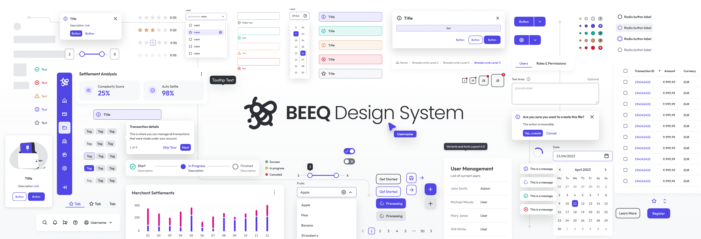

<!-- Hidden top link -->
<a id="readme-top"></a>

<div align="center">
  
</div>

<h1 align="center" style="font-size: 2rem;">BEEQ, a web component library initiative</h1>
<p align="center">This repository holds the source code of the web components present in the BEEQ Design System.</p>
<p align="center"><a href="https://beeq.design/" alt="BEEQ official documentation"><strong>Explore the documentation »</strong></a></p>
<br/>
<br/>
<p align="center">
  <a aria-label="license" href="./LICENSE">
    
  </a>
</p>
<br/>
<div align="center">

| Package                                                          | Version                                                                                                            | Documentation                            |
| ---------------------------------------------------------------- | ------------------------------------------------------------------------------------------------------------------ | ---------------------------------------- |
| [`@beeq/core`](https://www.npmjs.com/package/@beeq/core)       | [](https://www.npmjs.com/package/@beeq/core)       | [README](./packages/beeq/README.md)         |
| [`@beeq/angular`](https://www.npmjs.com/package/@beeq/angular) | [](https://www.npmjs.com/package/@beeq/angular) | [README](./packages/beeq-angular/README.md) |
| [`@beeq/react`](https://www.npmjs.com/package/@beeq/react)     | [](https://www.npmjs.com/package/@beeq/react)     | [README](./packages/beeq-react/README.md)   |
| [`@beeq/vue`](https://www.npmjs.com/package/@beeq/vue)     | [](https://www.npmjs.com/package/@beeq/vue)     | [README](./packages/beeq-vue/README.md)   |
| [`@beeq/tailwindcss`](https://www.npmjs.com/package/@beeq/tailwindcss)     | [](https://www.npmjs.com/package/@beeq/tailwindcss)     | [README](./packages/beeq-tailwindcss/README.md)   |

</div>

## Documentation 📚

Explore BEEQ, learn the fundamentals, and discover more advanced topics at the [**documentation site**](https://beeq.design)

- [Getting started](https://www.beeq.design/3d466e231/p/3352a6-getting-started)
- [Style guide](https://www.beeq.design/3d466e231/p/58b904-style-guide)
- [Advanced guides](https://www.beeq.design/3d466e231/p/6733bc-styles)
- [Roadmap](https://www.beeq.design/3d466e231/p/319f18-releases--roadmap)

### Storybook 📕

Feel free to [check our Storybook](https://storybook.beeq.design/) to see all the BEEQ components released. There you can find all the component's APIs (properties, events, and methods exposed) along with the variations that each component allows.

### Usage

The BEEQ components are published to the NPM package manager registry. You can use the `@beeq/core` or any of the framework-specific wrappers (`@beeq/angular`, `@beeq/react`) depending on the technology stack of your project. Make sure the follow the usage instructions for each package:

- 📘 [How to use the `@beeq/core` package](packages/beeq/README.md)
- 📗 [How to use the `@beeq/angular` package](packages/beeq-angular/README.md)
- 📕 [How to use the `@beeq/react` package](packages/beeq-react/README.md)
- 📙 [How to use the `@beeq/vue` package](packages/beeq-vue/README.md)
- 📓 [How to use the `@beeq/tailwindcss` preset](packages/beeq-tailwindcss/README.md)

<p align="right">(<a href="#readme-top">back to top</a>)</p>

## Development 👨‍💻

### Structure 🧩

The project has been structured as an [NX monorepo](https://nx.dev) :

```
├── 📁 packages
  ├── 📁 beeq
  ├── 📁 beeq-angular
  ├── 📁 beeq-react
  ├── 📁 beeq-vue
  ├── ...
  ├── 📁 beeq-tailwindcss
  ├── ...
├── 📁 tools
├── package.json
├── package-lock.json
```

where:

- **[packages/beeq](./packages/beeq/):** Core library (source for all the elements/components implemented)
- **[packages/beeq-angular](./packages/beeq-angular):** Angular-specific wrapper for BEEQ core library
- **[packages/beeq-react](./packages/beeq-react):** React.js-specific wrapper for BEEQ core library
- **[packages/beeq-vue](./packages/beeq-vue):** Vue.js-specific wrapper for BEEQ core library
- **[packages/beeq-tailwindcss](./packages/beeq-tailwindcss):** BEEQ's opinionated TailwindCSS configuration

<p align="right">(<a href="#readme-top">back to top</a>)</p>

### Dependencies 📡

We recommend the use of [Volta](https://volta.sh/) to manage Node and NPM versions. The [installation process](https://docs.volta.sh/guide/getting-started) is pretty straightforward, and as referenced on their official site:

> [!TIP]
> With Volta, you can select a Node engine once and then stop worrying about it. You can switch between projects and stop having to manually switch between Nodes.

Once you have Volta installed, whenever you change to the BEEQ folder locally, it will switch to the right Node and NPM versions [pinned in the `package.json`](./package.json#L177).

Volta is not mandatory, you can still use any Node/NPM setup that fits you most, just keep in mind that you'll need:

- [NodeJS](https://nodejs.org/en/download/) v18.x or higher
- [PNPM](https://pnpm.io/installation) v10 or higher

<p align="right">(<a href="#readme-top">back to top</a>)</p>

## Running the project 🏃‍

To develop/extend components on the BEEQ Design System, please fork this repo in GitHub and clone it locally to a new directory:

```bash
git clone https://github.com/<YOUR_GITHUB_USERNAME>/BEEQ.git BEEQ-Design-System
cd BEEQ-Design-System
git checkout main
```

### Installation ⚙️

Simply run:

```bash
pnpm i --frozen-lockfile
# Make sure to build first the project before starting it
pnpm build
pnpm start
```

Start coding 😃!

> [!TIP]
> Since we used [NX](https://nx.dev) to handle our monorepo, you can leverage powerful commands like `nx affected` to run commands only on projects affected by your changes, or `nx run-many` to run commands across multiple projects. For example:

```bash
# Run tests only on affected projects
nx affected:test

# Build all packages
nx run-many --target=build --all

# Run a specific target on multiple projects
nx run-many --target=lint --projects=beeq,beeq-react
```

> We use these commands in our CI pipeline to optimize our build and test processes. Feel free to check out [our CircleCI config](.circleci/config.yml) to see how we implement them!
> Don't forget to check out the [NX documentation](https://nx.dev/using-nx/affected) for more tips on working with monorepos.

### Build 📦

For a Production build, just run:

```bash
pnpm build
```

<p align="right">(<a href="#readme-top">back to top</a>)</p>

### Test 🧪

BEEQ uses [Jest](https://jestjs.io/) for unit tests and Jest and [Puppeteer](https://pptr.dev/) for end-to-end tests.

> [!IMPORTANT]
> Puppeteer uses Chromium to run the tests. Make sure you have Chrome installed on your machine or set the `PUPPETEER_EXECUTABLE_PATH` environment variable to point to the path of your Chromium browser executable.
> E.g., `export PUPPETEER_EXECUTABLE_PATH="/Applications/Google Chrome.app/Contents/MacOS/Google Chrome"`

You can run all the tests once, by executing:

```bash
pnpm test
```

or run unit tests and e2e tests separately:

```bash
pnpm test:spec
pnpm test:e2e
```

> [!TIP]
> You can execute specific tests, whether they're spec tests or e2e tests, by supplying the file name as an argument (if you want to run tests in watch mode, just add the `--watch` argument).

```bash
pnpm test:spec -- debounce --watch
```

```bash
pnpm test:e2e -- dialog --watch
```

<p align="right">(<a href="#readme-top">back to top</a>)</p>

### Generate component

BEEQ comes with a component generator that saves you time when creating the skeleton for a new component. To use the generator, you just need to run the following command and follow the instructions in your prompt CLI:

```bash
pnpm g
```


## Contributing 💻

💥 If you are in the mood and want to help 🙂, please read carefully our [Contributing Guidelines](./CONTRIBUTING.md) and Development Standards.

❗️ When working on a bug fix, new feature, etc., please notice that we follow a [GitFlow workflow](https://www.atlassian.com/git/tutorials/comparing-workflows/gitflow-workflow). Make sure to [follow the instructions from the Contributing Branching Strategy guidelines](./CONTRIBUTING.md#branching-strategy) about how to create your branch when starting to work on a bug/hot fixing, new feature, etc.

<p align="right">(<a href="#readme-top">back to top</a>)</p>

## Documentation 📖

### StencilJs

Need help? Check out the Stenciljs docs here (https://stenciljs.com/).

### Tailwind CSS

We use Tailwind CSS for the style of the components, please take a look at their documentation here: (https://tailwindcss.com/docs/)

## Thanks 🙏

<a href="https://www.chromatic.com/">
  
</a>

We would like to express our sincere gratitude to [Chromatic](https://www.chromatic.com/) for providing the visual testing platform that enables us to review UI changes and identify visual regressions.

<a href="https://nx.dev/">
  
</a>

Thank you to the [Nx](https://nx.dev/) team for helping us streamline our CI process and efficiently manage our Monorepo.

<p align="right">(<a href="#readme-top">back to top</a>)</p>
