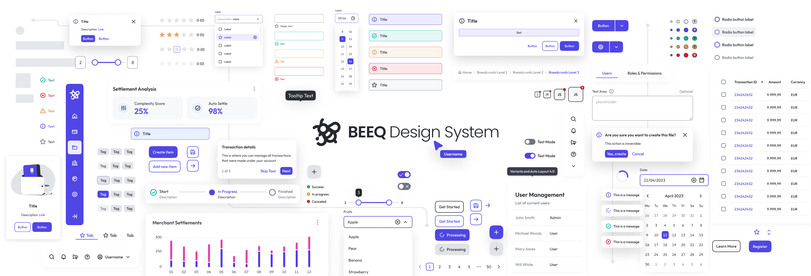

<div align="center">
  
</div>

<h1 align="center">BEEQ, a web component library initiative</h1>

<p align="center">This repository holds the source code of the web components present in the BEEQ Design System.</p>

<p align="center">
  <a aria-label="license" href="./LICENSE">
    
  </a>
</p>

<div align="center">

| Package                                                          | Version                                                                                                            | Documentation                            |
| ---------------------------------------------------------------- | ------------------------------------------------------------------------------------------------------------------ | ---------------------------------------- |
| [`@bee-q/core`](https://www.npmjs.com/package/@bee-q/core)       | [](https://www.npmjs.com/package/@bee-q/core)       | [README](./packages/beeq/README.md)         |
| [`@bee-q/angular`](https://www.npmjs.com/package/@bee-q/angular) | [](https://www.npmjs.com/package/@bee-q/angular) | [README](./packages/beeq-angular/README.md) |
| [`@bee-q/react`](https://www.npmjs.com/package/@bee-q/react)     | [](https://www.npmjs.com/package/@bee-q/react)     | [README](./packages/beeq-react/README.md)   |
| [`@bee-q/vue`](https://www.npmjs.com/package/@bee-q/vue)     | [](https://www.npmjs.com/package/@bee-q/vue)     | [README](./packages/beeq-vue/README.md)   |
| [`@bee-q/tailwindcss`](https://www.npmjs.com/package/@bee-q/tailwindcss)     | [](https://www.npmjs.com/package/@bee-q/tailwindcss)     | [README](./packages/beeq-tailwindcss/README.md)   |

</div>

## ⚠️ Before Starting ⚠️

### Structure 🧩

The project has been structured as an [NX monorepo](https://nx.dev) :

```
├── 📁 packages
  ├── 📁 beeq
  ├── 📁 beeq-angular
  ├── 📁 beeq-react
  ├── 📁 beeq-vue
  ├── ...
  ├── 📁 beeq-tailwindcss
  ├── ...
├── 📁 tools
├── package.json
├── package-lock.json
```

where:

- **[packages/beeq](./packages/beeq/):** Core library (source for all the elements/components implemented)
- **[packages/beeq-angular](./packages/beeq-angular):** Angular-specific wrapper for BEEQ core library
- **[packages/beeq-react](./packages/beeq-react):** React.js-specific wrapper for BEEQ core library
- **[packages/beeq-vue](./packages/beeq-vue):** Vue.js-specific wrapper for BEEQ core library
- **[packages/beeq-tailwindcss](./packages/beeq-tailwindcss):** BEEQ's opinionated TailwindCSS configuration

### Dependencies 📡

We recommend the use of [Volta](https://volta.sh/) to manage Node and NPM versions. The [installation process](https://docs.volta.sh/guide/getting-started) is pretty straightforward, and as referenced on their official site:

> With Volta, you can select a Node engine once and then stop worrying about it. You can switch between projects and stop having to manually switch between Nodes.

Once you have Volta installed, whenever you change to the BEEQ folder locally, it will switch to the right Node and NPM versions pinned in the `package.json`:

```json
  "volta": {
    "node": "20.9.0",
    "npm": "10.2.1"
  }
```

Volta is not mandatory, you can still use any Node/NPM setup that fits you most, just keep in mind that you'll need:

- [`NodeJS`](https://nodejs.org/en/download/) v16.x or higher
- [NPM](https://nodejs.org/en/knowledge/getting-started/npm/what-is-npm/) v8 or higher

## Usage

The BEEQ components are published to the NPM package manager registry. You can use the `@bee-q/core` or any of the framework-specific wrappers (`@bee-q/angular`, `@bee-q/react`) depending on the technology stack of your project. Make sure the follow the usage instructions for each package:

- 📘 [How to use the `@bee-q/core` package](packages/beeq/README.md)
- 📗 [How to use the `@bee-q/angular` package](packages/beeq-angular/README.md)
- 📕 [How to use the `@bee-q/react` package](packages/beeq-react/README.md)
- 📙 [How to use the `@bee-q/vue` package](packages/beeq-vue/README.md)
- 📓 [How to use the `@bee-q/tailwindcss` preset](packages/beeq-tailwindcss/README.md)

Feel free to [check our Storybook](https://storybook.beeq.design/) to see all the BEEQ components released. There you can find all the component's APIs (properties, events, and methods exposed) along with the variations that each component allows.

## Running the project 🏃‍

To develop/extend components on the BEEQ Design System, please fork this repo in GitHub and clone it locally to a new directory:

```bash
git clone https://github.com/<YOUR_GITHUB_USERNAME>/BEEQ.git BEEQ-Design-System
git checkout develop
cd BEEQ-Design-System
```

### Installation ⚙️

Simply run:

```bash
npm ci
# Make sure to build first the project before starting it
npm run build
npm start
```

Start coding 😃!

### Build 📦

For a Production build, just run:

```bash
npm run build
```

### Test 🧪

BEEQ uses [Jest](https://jestjs.io/) for unit tests and Jest and [Puppeteer](https://pptr.dev/) for end-to-end tests.

You can run all the tests once, by executing:

```bash
npm run test
```

🚨 If you get an error similar to the one below, **try to check out locally the `main` branch and run the tests again**.

```bash
fatal: Not a valid object name main
fatal: No such ref: 'main'
nx affected
```

### Generate component

BEEQ comes with a component generator that saves you time when creating the skeleton for a new component. To use the generator, you just need to run the following command and follow the instructions in your prompt CLI:

```bash
npm run g
```

## Contributing 💻

💥 If you are in the mood and want to help 🙂, please read carefully our [Contributing Guidelines](./CONTRIBUTING.md) and Development Standards.

❗️ When working on a bug fix, new feature, etc., please notice that we follow a [GitFlow workflow](https://www.atlassian.com/git/tutorials/comparing-workflows/gitflow-workflow). Make sure to [follow the instructions from the Contributing Branching Strategy guidelines](./CONTRIBUTING.md#branching-strategy) about how to create your branch when starting to work on a bug/hot fixing, new feature, etc.

## Documentation 📖

### StencilJs

Need help? Check out the Stenciljs docs here (https://stenciljs.com/).

### Tailwind CSS

We use Tailwind CSS for the style of the components, please take a look at their documentation here: (https://tailwindcss.com/docs/)
