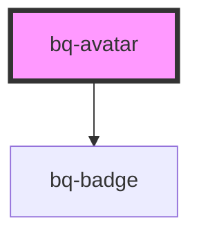

# bq-avatar

<!-- Auto Generated Below -->

## Overview

An avatar represents an object made of different pieces of information, in a way that is understandable at a glance.

## Properties

| Property       | Attribute       | Description                                                                      | Type                                         | Default     |
| -------------- | --------------- | -------------------------------------------------------------------------------- | -------------------------------------------- | ----------- |
| `altText`      | `alt-text`      | Alternate text for the avatar image if the image cannot be displayed             | `string`                                     | `undefined` |
| `badgeContent` | `badge-content` | The string to display in the badge                                               | `string`                                     | `undefined` |
| `image`        | `image`         | The image source to load on the avatar (this can be also a base64 encoded image) | `string`                                     | `undefined` |
| `initials`     | `initials`      | The text to display on avatar                                                    | `string`                                     | `undefined` |
| `label`        | `label`         | A text to use for describing the avatar on assistive devices                     | `string`                                     | `undefined` |
| `shape`        | `shape`         | The shape of the avatar                                                          | `"circle" \| "square"`                       | `'circle'`  |
| `size`         | `size`          | The size of the avatar                                                           | `"large" \| "medium" \| "small" \| "xsmall"` | `'medium'`  |

## Shadow Parts

| Part     | Description                                                       |
| -------- | ----------------------------------------------------------------- |
| `"base"` | The component's internal wrapper.                                 |
| `"img"`  | The `<image>` tag element that load the image source.             |
| `"text"` | The `` tag element that renderd the `Initials` text string. |

## Dependencies

### Depends on

- [bq-badge](../badge)

### Graph

----------------------------------------------

*Built with [StencilJS](https://stenciljs.com/)*
