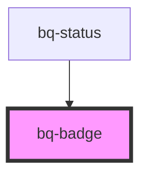

# bq-badge

<!-- Auto Generated Below -->

## Properties

| Property          | Attribute          | Description                                                                    | Type                  | Default           |
| ----------------- | ------------------ | ------------------------------------------------------------------------------ | --------------------- | ----------------- |
| `backgroundColor` | `background-color` | Badge background color. The value should be a valid value of the palette color | `string`              | `'ui--danger'`    |
| `size`            | `size`             | The size of the badge. Relevant if badge has no content.                       | `"medium" \| "small"` | `'small'`         |
| `textColor`       | `text-color`       | Badge number color. The value should be a valid value of the palette color     | `string`              | `'text--inverse'` |

## Shadow Parts

| Part       | Description                                            |
| ---------- | ------------------------------------------------------ |
| `"base"`   | The component's internal wrapper that holds the count. |
| `"number"` | The component's internal wrapper that holds the slot.  |

## Dependencies

### Used by

 - [bq-status](../status)

### Graph

----------------------------------------------

*Built with [StencilJS](https://stenciljs.com/)*
