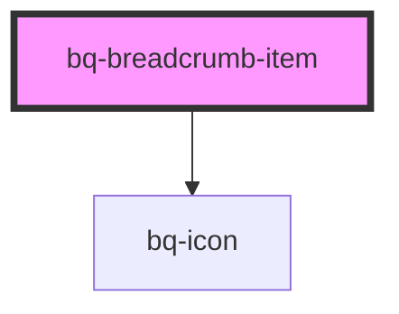

# bq-breadcrumb-item

<!-- Auto Generated Below -->

## Properties

| Property                     | Attribute        | Description                                                                                                          | Type                                         | Default                 |
| ---------------------------- | ---------------- | -------------------------------------------------------------------------------------------------------------------- | -------------------------------------------- | ----------------------- |
| `href`                       | `href`           | If set, the breadcrumb item will be rendered as an `<a>` with this `href`, otherwise, a `<button>` will be rendered. | `string`                                     | `undefined`             |
| `isLast`                     | `is-last`        | If true, the item is the last element inside breadcrumb                                                              | `boolean`                                    | `false`                 |
| `rel`                        | `rel`            | Where to display the link in the browser context. Relevant only if `href` is set.                                    | `string`                                     | `'noreferrer noopener'` |
| `separatorIcon` _(required)_ | `separator-icon` | The icon name used as separator. Default is `/`.                                                                     | `string`                                     | `undefined`             |
| `target`                     | `target`         | Where to display the link in the browser context. Relevant only if `href` is set.                                    | `"_blank" \| "_parent" \| "_self" \| "_top"` | `undefined`             |

## Events

| Event     | Description                                | Type                                       |
| --------- | ------------------------------------------ | ------------------------------------------ |
| `bqBlur`  | Handler to be called when item loses focus | `CustomEvent<HTMLBqBreadcrumbItemElement>` |
| `bqClick` | Handler to be called when item is clicked  | `CustomEvent<HTMLBqBreadcrumbItemElement>` |
| `bqFocus` | Handler to be called when item is focused  | `CustomEvent<HTMLBqBreadcrumbItemElement>` |

## Shadow Parts

| Part       | Description |
| ---------- | ----------- |
| `"label"`  |             |
| `"prefix"` |             |
| `"suffix"` |             |

## Dependencies

### Depends on

- [bq-icon](../icon)

### Graph

----------------------------------------------

*Built with [StencilJS](https://stenciljs.com/)*
