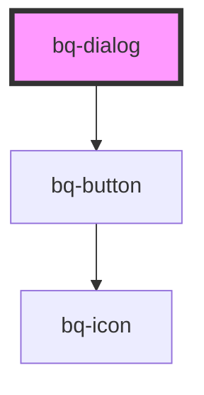

# bq-dialog

<!-- Auto Generated Below -->

## Properties

| Property | Attribute | Description | Type      | Default |
| -------- | --------- | ----------- | --------- | ------- |
| `isOpen` | `is-open` |             | `boolean` | `false` |

## Dependencies

### Depends on

- [bq-button](../button)

### Graph

----------------------------------------------

*Built with [StencilJS](https://stenciljs.com/)*
