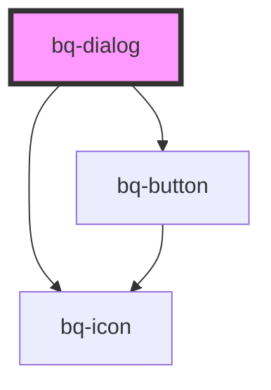

# bq-dialog

<!-- Auto Generated Below -->

## Properties

| Property  | Attribute | Description                                             | Type                             | Default      |
| --------- | --------- | ------------------------------------------------------- | -------------------------------- | ------------ |
| `size`    | `size`    | The size of the dialog                                  | `"large" \| "medium" \| "small"` | `'large'`    |
| `variant` | `variant` | The variant of button to apply on top of the appearance | `"light" \| "standard"`          | `'standard'` |

## Shadow Parts

| Part        | Description |
| ----------- | ----------- |
| `"icon-on"` |             |

## Dependencies

### Depends on

- [bq-button](../button)
- [bq-icon](../icon)

### Graph

----------------------------------------------

*Built with [StencilJS](https://stenciljs.com/)*
