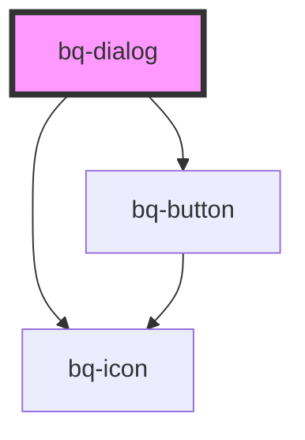

# bq-dialog

<!-- Auto Generated Below -->

## Properties

| Property          | Attribute          | Description              | Type                             | Default      |
| ----------------- | ------------------ | ------------------------ | -------------------------------- | ------------ |
| `footerApperance` | `footer-apperance` | The appearance of footer | `"highlight" \| "standard"`      | `'standard'` |
| `size`            | `size`             | The size of the dialog   | `"large" \| "medium" \| "small"` | `'medium'`   |

## Methods

### `close() => Promise<void>`

Hides  the dialog

#### Returns

Type: `Promise<void>`

### `open() => Promise<void>`

Shows the dialog

#### Returns

Type: `Promise<void>`

## Shadow Parts

| Part             | Description                                           |
| ---------------- | ----------------------------------------------------- |
| `"base"`         | The component wrapper container inside the shadow DOM |
| `"button-close"` | The button that close the dialog on click             |
| `"container"`    | The `
` container that holds the dialog content   |
| `"footer"`       | The `<footer>` that holds footer content              |

## Dependencies

### Depends on

- [bq-button](../button)
- [bq-icon](../icon)

### Graph

----------------------------------------------

*Built with [StencilJS](https://stenciljs.com/)*
