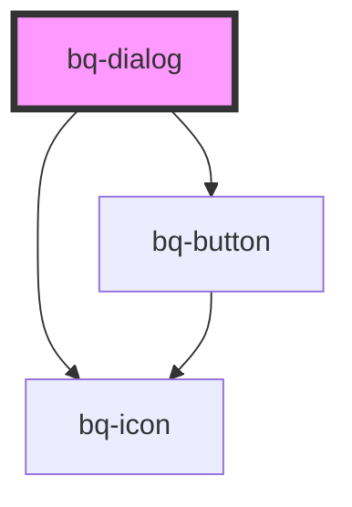

# bq-dialog

<!-- Auto Generated Below -->

## Properties

| Property                   | Attribute                     | Description                             | Type                             | Default      |
| -------------------------- | ----------------------------- | --------------------------------------- | -------------------------------- | ------------ |
| `disableEscKeyDownClose`   | `disable-esc-key-down-close`  | If true will not close on escape press  | `boolean`                        | `false`      |
| `disableOutsideClickClose` | `disable-outside-click-close` | If true will not close on outside click | `boolean`                        | `false`      |
| `footerApperance`          | `footer-apperance`            | The appearance of footer                | `"highlight" \| "standard"`      | `'standard'` |
| `hideCloseButton`          | `hide-close-button`           | If true it hides close button           | `boolean`                        | `false`      |
| `size`                     | `size`                        | The size of the dialog                  | `"large" \| "medium" \| "small"` | `'medium'`   |

## Methods

### `close() => Promise<void>`

Hides  the dialog

#### Returns

Type: `Promise<void>`

### `open() => Promise<void>`

Shows the dialog

#### Returns

Type: `Promise<void>`

## Shadow Parts

| Part                                                            | Description                                                             |
| --------------------------------------------------------------- | ----------------------------------------------------------------------- |
| `"backdrop"`                                                    | The `
` that displays the background                                |
| `"base"`                                                        | The component wrapper container inside the shadow DOM                   |
| `"button-close"`                                                | The button that close the dialog on click                               |
| `"container"`                                                   | The `
` container that holds the dialog content                     |
| `"content"`                                                     |                                                                         |
| `"content- The `<main>` that holds the content"`                |                                                                         |
| `"description"`                                                 |                                                                         |
| `"description- The `
` that holds the description content"` |                                                                         |
| `"footer"`                                                      | The `<footer>` that holds footer content                                |
| `"header"`                                                      | The `<header>` that holds the icon, title, description and close button |
| `"icon"`                                                        | The `
` that holds the info icon                                    |
| `"title"`                                                       | The `
` that holds the title content                                |

## Dependencies

### Depends on

- [bq-button](../button)
- [bq-icon](../icon)

### Graph

----------------------------------------------

*Built with [StencilJS](https://stenciljs.com/)*
