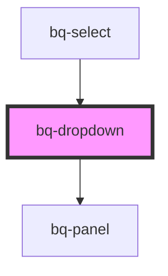

# bq-dropdown

<!-- Auto Generated Below -->

## Properties

| Property           | Attribute             | Description                                                                           | Type                                                                                                                                                                 | Default          |
| ------------------ | --------------------- | ------------------------------------------------------------------------------------- | -------------------------------------------------------------------------------------------------------------------------------------------------------------------- | ---------------- |
| `disabled`         | `disabled`            | If true, the dropdown panel will be visible and won't be shown.                       | `boolean`                                                                                                                                                            | `false`          |
| `distance`         | `distance`            | Represents the distance (gutter or margin) between the panel and the trigger element. | `number`                                                                                                                                                             | `4`              |
| `keepOpenOnSelect` | `keep-open-on-select` | If true, the panel will remain open after a selection is made.                        | `boolean`                                                                                                                                                            | `false`          |
| `open`             | `open`                | If true, the panel will be visible.                                                   | `boolean`                                                                                                                                                            | `false`          |
| `panelHeight`      | `panel-height`        | When set, it will override the height of the dropdown panel                           | `string`                                                                                                                                                             | `undefined`      |
| `placement`        | `placement`           | Position of the panel                                                                 | `"bottom" \| "bottom-end" \| "bottom-start" \| "left" \| "left-end" \| "left-start" \| "right" \| "right-end" \| "right-start" \| "top" \| "top-end" \| "top-start"` | `'bottom-start'` |
| `sameWidth`        | `same-width`          | Whether the panel should have the same width as the trigger element                   | `boolean`                                                                                                                                                            | `false`          |
| `skidding`         | `skidding`            | Represents the skidding between the panel and the trigger element.                    | `number`                                                                                                                                                             | `0`              |
| `strategy`         | `strategy`            | Defines the strategy to position the panel                                            | `"absolute" \| "fixed"`                                                                                                                                              | `'fixed'`        |

## Events

| Event    | Description                                                                | Type                              |
| -------- | -------------------------------------------------------------------------- | --------------------------------- |
| `bqOpen` | Callback handler to be called when the dropdown panel is opened or closed. | `CustomEvent<{ open: boolean; }>` |

## Shadow Parts

| Part         | Description                                                                             |
| ------------ | --------------------------------------------------------------------------------------- |
| `"base"`     | The component's internal wrapper.                                                       |
| `"dropdown"` | The `<bq-panel>` element used under the hood to display the dropdown panel              |
| `"panel"`    | The `
` element used to display and style the panel inside the `<bq-panel>` element |
| `"trigger"`  | The `
` element that hosts the trigger element                                      |

## Dependencies

### Used by

 - [bq-select](../select)

### Depends on

- [bq-panel](../panel)

### Graph

----------------------------------------------

*Built with [StencilJS](https://stenciljs.com/)*
