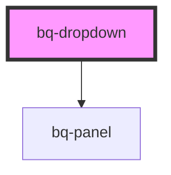

# bq-dropdown

<!-- Auto Generated Below -->

## Properties

| Property         | Attribute    | Description                                                                           | Type                                                                                                                                                                 | Default          |
| ---------------- | ------------ | ------------------------------------------------------------------------------------- | -------------------------------------------------------------------------------------------------------------------------------------------------------------------- | ---------------- |
| `distance`       | `distance`   | Represents the distance (gutter or margin) between the panel and the trigger element. | `number`                                                                                                                                                             | `4`              |
| `open`           | `open`       | If true, the panel will be visible.                                                   | `boolean`                                                                                                                                                            | `false`          |
| `placement`      | `placement`  | Position of the panel                                                                 | `"bottom" \| "bottom-end" \| "bottom-start" \| "left" \| "left-end" \| "left-start" \| "right" \| "right-end" \| "right-start" \| "top" \| "top-end" \| "top-start"` | `'bottom-start'` |
| `sameWidth`      | `same-width` | Whether the panel should have the same width as the trigger element                   | `boolean`                                                                                                                                                            | `false`          |
| `scrollbar`      | `scrollbar`  | Determines whether the scrollbar is visible or hidden within the panel.               | `boolean`                                                                                                                                                            | `false`          |
| `skidding`       | `skidding`   | Represents the skidding between the panel and the trigger element.                    | `number`                                                                                                                                                             | `0`              |
| `strategy`       | `strategy`   | Defines the strategy to position the panel                                            | `"absolute" \| "fixed"`                                                                                                                                              | `'fixed'`        |
| `triggerElement` | --           | The trigger element for the panel                                                     | `HTMLElement`                                                                                                                                                        | `undefined`      |

## Events

| Event           | Description                                                                      | Type                                |
| --------------- | -------------------------------------------------------------------------------- | ----------------------------------- |
| `bqPanelChange` | Handler to be called to check if the `bq-panel` switches state (visible/hidden). | `CustomEvent<{ opened: boolean; }>` |

## Shadow Parts

| Part        | Description                                                    |
| ----------- | -------------------------------------------------------------- |
| `"base"`    | The component's internal wrapper.                              |
| `"panel"`   | The `div` element used to display the panel element (bq-panel) |
| `"trigger"` | The `div` element used to display the trigger element          |

## Dependencies

### Depends on

- [bq-panel](../panel)

### Graph

----------------------------------------------

*Built with [StencilJS](https://stenciljs.com/)*
