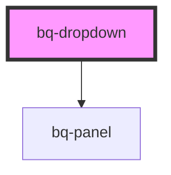

# bq-dropdown

<!-- Auto Generated Below -->

## Properties

| Property         | Attribute         | Description                                                                      | Type                                                                                                                                                                 | Default    |
| ---------------- | ----------------- | -------------------------------------------------------------------------------- | -------------------------------------------------------------------------------------------------------------------------------------------------------------------- | ---------- |
| `panelDistance`  | `panel-distance`  | Distance between the panel and the trigger element.                              | `number`                                                                                                                                                             | `0`        |
| `panelOpen`      | `panel-open`      | If true, panel is visible. You can toggle this attribute to show/hide the panel. | `boolean`                                                                                                                                                            | `false`    |
| `panelPlacement` | `panel-placement` | Position of the panel                                                            | `"bottom" \| "bottom-end" \| "bottom-start" \| "left" \| "left-end" \| "left-start" \| "right" \| "right-end" \| "right-start" \| "top" \| "top-end" \| "top-start"` | `'bottom'` |
| `panelScrollbar` | `panel-scrollbar` | Determines whether the scrollbar is visible or hidden within the panel.          | `boolean`                                                                                                                                                            | `false`    |

## Events

| Event            | Description                                                               | Type                       |
| ---------------- | ------------------------------------------------------------------------- | -------------------------- |
| `bqOptionBlur`   | Handler to be called when `bq-option` item loses focus.                   | `CustomEvent<HTMLElement>` |
| `bqOptionFocus`  | Handler to be called when `bq-option` item gets focus.                    | `CustomEvent<HTMLElement>` |
| `bqOptionSelect` | Handler to be called when `bq-option` is selected (on click/enter press). | `CustomEvent<HTMLElement>` |
| `bqPanelOpen`    | Handler to be called when the `bq-panel` switches state (visible/hidden). | `CustomEvent<boolean>`     |

## Shadow Parts

| Part        | Description                                                    |
| ----------- | -------------------------------------------------------------- |
| `"panel"`   | The `div` element used to display the panel element (bq-panel) |
| `"trigger"` | The `div` element used to display the trigger element          |

## Dependencies

### Depends on

- [bq-panel](../panel)

### Graph

----------------------------------------------

*Built with [StencilJS](https://stenciljs.com/)*
