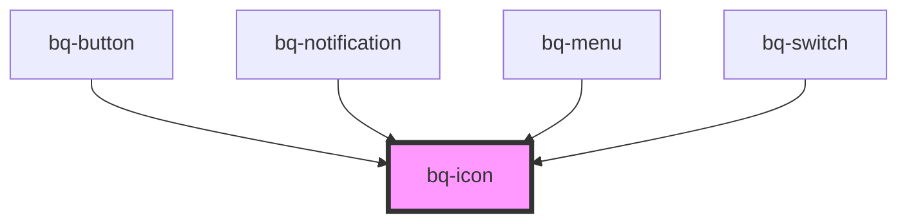

# bq-icon

<!-- Auto Generated Below -->

## Overview

Icons are simplified images that graphically explain the meaning of an object on the screen.

## Properties

| Property            | Attribute | Description                                                                             | Type                                                              | Default     |
| ------------------- | --------- | --------------------------------------------------------------------------------------- | ----------------------------------------------------------------- | ----------- |
| `color`             | `color`   | Set the stroke color of the SVG. The value should be a valid value of the palette color | `string`                                                          | `undefined` |
| `name` _(required)_ | `name`    | Icon name to load. Please check all available icons [here](https://phosphoricons.com/)  | `string`                                                          | `undefined` |
| `size`              | `size`    | Set the size of the SVG                                                                 | `number \| string`                                                | `24`        |
| `weight`            | `weight`  | It set the icon weight/style                                                            | `"bold" \| "duotone" \| "fill" \| "light" \| "regular" \| "thin"` | `'regular'` |

## Events

| Event       | Description                                           | Type               |
| ----------- | ----------------------------------------------------- | ------------------ |
| `svgLoaded` | Callback handler to be called when the SVG has loaded | `CustomEvent<any>` |

## Shadow Parts

| Part     | Description                                                       |
| -------- | ----------------------------------------------------------------- |
| `"base"` | The component's internal wrapper that holds the icon SVG content. |
| `"svg"`  | The `<svg>` tag element inside the component.                     |

## Dependencies

### Used by

- [bq-button](../button)
- [bq-notification](../notification)
- [bq-menu](../menu)
- [bq-switch](../switch)

### Graph

---

_Built with [StencilJS](https://stenciljs.com/)_
