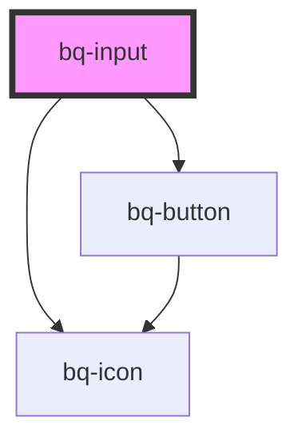

# bq-input

<!-- Auto Generated Below -->

## Properties

| Property      | Attribute     | Description                      | Type     | Default     |
| ------------- | ------------- | -------------------------------- | -------- | ----------- |
| `placeholder` | `placeholder` | The input placeholder text value | `string` | `undefined` |

## Shadow Parts

| Part          | Description                                        |
| ------------- | -------------------------------------------------- |
| `"base"`      | The component's base wrapper.                      |
| `"clear-btn"` | The clear button.                                  |
| `"input"`     | The native HTML input element used under the hood. |
| `"prefix"`    | The prefix slot container.                         |
| `"suffix"`    | The suffix slot container.                         |

## Dependencies

### Depends on

- [bq-button](../button)
- [bq-icon](../icon)

### Graph

----------------------------------------------

*Built with [StencilJS](https://stenciljs.com/)*
