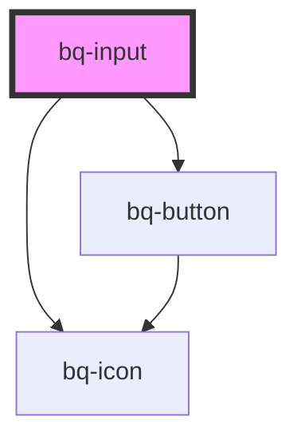

# bq-input

<!-- Auto Generated Below -->

## Properties

| Property           | Attribute            | Description                                                            | Type                           | Default         |
| ------------------ | -------------------- | ---------------------------------------------------------------------- | ------------------------------ | --------------- |
| `clearButtonLabel` | `clear-button-label` | The clear button aria label                                            | `string`                       | `'Clear value'` |
| `disableClear`     | `disable-clear`      | If true, the clear button won't be displayed                           | `boolean`                      | `false`         |
| `placeholder`      | `placeholder`        | The input placeholder text value                                       | `string`                       | `undefined`     |
| `value`            | `value`              | The input value, it can be used to reset the input to a previous value | `number \| string \| string[]` | `undefined`     |

## Events

| Event      | Description                                                    | Type                                                    |
| ---------- | -------------------------------------------------------------- | ------------------------------------------------------- |
| `bqChange` | Callback handler emitted when the input value has changed      | `CustomEvent<{ value: string \| number \| string[]; }>` |
| `bqClear`  | Callback handler emitted when the input value has been cleared | `CustomEvent<void>`                                     |

## Shadow Parts

| Part            | Description                                                     |
| --------------- | --------------------------------------------------------------- |
| `"base"`        | The component's base wrapper.                                   |
| `"button"`      | The native HTML button used under the hood in the clear button. |
| `"clear-btn"`   | The clear button.                                               |
| `"control"`     | The input control wrapper.                                      |
| `"helper-text"` | The helper text slot container.                                 |
| `"input"`       | The native HTML input element used under the hood.              |
| `"label"`       | The label slot container.                                       |
| `"prefix"`      | The prefix slot container.                                      |
| `"suffix"`      | The suffix slot container.                                      |

## Dependencies

### Depends on

- [bq-button](../button)
- [bq-icon](../icon)

### Graph

----------------------------------------------

*Built with [StencilJS](https://stenciljs.com/)*
