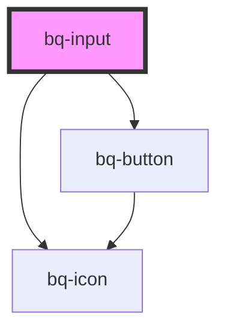

# bq-input

<!-- Auto Generated Below -->

## Properties

| Property           | Attribute            | Description                                                                                                                                                  | Type                                          | Default         |
| ------------------ | -------------------- | ------------------------------------------------------------------------------------------------------------------------------------------------------------ | --------------------------------------------- | --------------- |
| `clearButtonLabel` | `clear-button-label` | The clear button aria label                                                                                                                                  | `string`                                      | `'Clear value'` |
| `debounceTime`     | `debounce-time`      | The amount of time, in milliseconds, to wait before emitting the `bqInput` event after the input value changes. A value of 0 means no debouncing will occur. | `number`                                      | `0`             |
| `disableClear`     | `disable-clear`      | If true, the clear button won't be displayed                                                                                                                 | `boolean`                                     | `false`         |
| `disabled`         | `disabled`           | Indicates whether the input is disabled or not. If `true`, the input is disabled and cannot be interacted with.                                              | `boolean`                                     | `false`         |
| `placeholder`      | `placeholder`        | The input placeholder text value                                                                                                                             | `string`                                      | `undefined`     |
| `validationStatus` | `validation-status`  | The validation status of the input.                                                                                                                          | `"error" \| "none" \| "success" \| "warning"` | `'none'`        |
| `value`            | `value`              | The input value, it can be used to reset the input to a previous value                                                                                       | `number \| string \| string[]`                | `undefined`     |

## Events

| Event      | Description                                                                                                                                                                                                                    | Type                                                           |
| ---------- | ------------------------------------------------------------------------------------------------------------------------------------------------------------------------------------------------------------------------------ | -------------------------------------------------------------- |
| `bqBlur`   | Callback handler emitted when the input loses focus                                                                                                                                                                            | `CustomEvent<HTMLBqInputElement>`                              |
| `bqChange` | Callback handler emitted when the input value has changed and the input loses focus. This handler is called whenever the user finishes typing or pasting text into the input field and then clicks outside of the input field. | `CustomEvent<{ value: TInputValue; el: HTMLBqInputElement; }>` |
| `bqClear`  | Callback handler emitted when the input value has been cleared                                                                                                                                                                 | `CustomEvent<HTMLBqInputElement>`                              |
| `bqFocus`  | Callback handler emitted when the input has received focus                                                                                                                                                                     | `CustomEvent<HTMLBqInputElement>`                              |
| `bqInput`  | Callback handler emitted when the input value changes. This handler is called whenever the user types or pastes text into the input field.                                                                                     | `CustomEvent<{ value: TInputValue; el: HTMLBqInputElement; }>` |

## Shadow Parts

| Part            | Description                                                     |
| --------------- | --------------------------------------------------------------- |
| `"base"`        | The component's base wrapper.                                   |
| `"button"`      | The native HTML button used under the hood in the clear button. |
| `"clear-btn"`   | The clear button.                                               |
| `"control"`     | The input control wrapper.                                      |
| `"helper-text"` | The helper text slot container.                                 |
| `"input"`       | The native HTML input element used under the hood.              |
| `"label"`       | The label slot container.                                       |
| `"prefix"`      | The prefix slot container.                                      |
| `"suffix"`      | The suffix slot container.                                      |

## Dependencies

### Depends on

- [bq-button](../button)
- [bq-icon](../icon)

### Graph

----------------------------------------------

*Built with [StencilJS](https://stenciljs.com/)*
