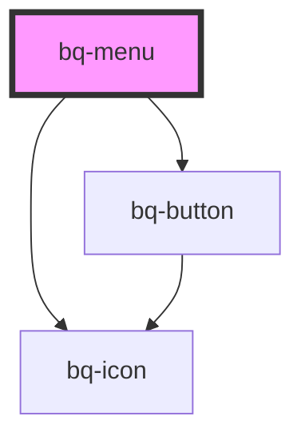

# bq-menu

<!-- Auto Generated Below -->

## Properties

| Property      | Attribute     | Description | Type      | Default |
| ------------- | ------------- | ----------- | --------- | ------- |
| `collapsible` | `collapsible` | Toggle menu | `boolean` | `true`  |

## Shadow Parts

| Part       | Description |
| ---------- | ----------- |
| `"group"`  |             |
| `"header"` |             |

## Dependencies

### Depends on

- [bq-button](../button)
- [bq-icon](../icon)

### Graph

----------------------------------------------

*Built with [StencilJS](https://stenciljs.com/)*
