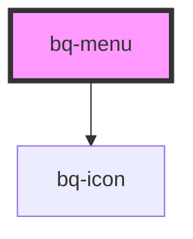

# bq-menu

<!-- Auto Generated Below -->

## Properties

| Property | Attribute | Description               | Type                  | Default    |
| -------- | --------- | ------------------------- | --------------------- | ---------- |
| `size`   | `size`    | The size of the menu item | `"medium" \| "small"` | `'medium'` |

## Dependencies

### Depends on

- [bq-icon](../icon)

### Graph

----------------------------------------------

*Built with [StencilJS](https://stenciljs.com/)*
