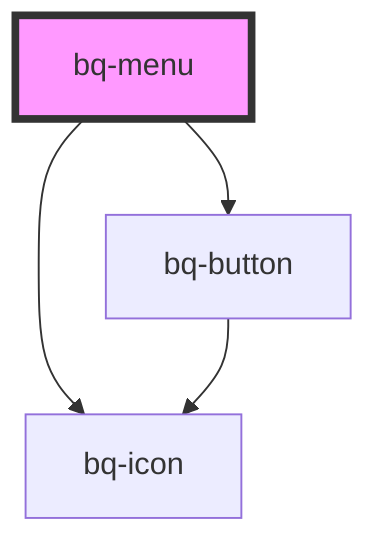

# bq-menu

<!-- Auto Generated Below -->

## Overview

A menu is like a widget that offers a list of choices to the user.

## Properties

| Property      | Attribute     | Description                                | Type                  | Default    |
| ------------- | ------------- | ------------------------------------------ | --------------------- | ---------- |
| `collapsible` | `collapsible` | Show footer for collapsible menu (boolean) | `boolean`             | `true`     |
| `size`        | `size`        | Set menu item size (small/medium)          | `"medium" \| "small"` | `'medium'` |
| `theme`       | `theme`       | Set theme (light/dark)                     | `"dark" \| "light"`   | `'light'`  |

## Events

| Event     | Description                                    | Type                                 |
| --------- | ---------------------------------------------- | ------------------------------------ |
| `bqBlur`  | Handler to be called when the item loses focus | `CustomEvent<HTMLBqMenuItemElement>` |
| `bqClick` | Handler to be called when item is clicked      | `CustomEvent<HTMLBqMenuItemElement>` |
| `bqFocus` | Handler to be called when the item gets focus  | `CustomEvent<HTMLBqMenuItemElement>` |

## Shadow Parts

| Part        | Description                                                                               |
| ----------- | ----------------------------------------------------------------------------------------- |
| `"content"` | The `span` tag element used to display the content of the menu (bq-menu-item components). |
| `"footer"`  | The `span` tag element used to display the collapsible element (text).                    |
| `"group"`   | The `aside` tag element used to group the menu item elements.                             |
| `"header"`  | The `span` tag element used to display the header part of the menu (bq-icon, title).      |

## Dependencies

### Depends on

- [bq-icon](../icon)
- [bq-button](../button)

### Graph

----------------------------------------------

*Built with [StencilJS](https://stenciljs.com/)*
