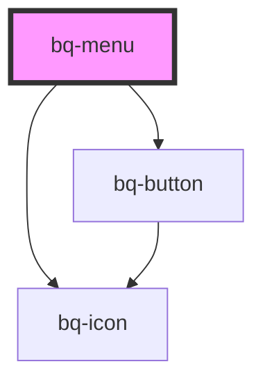

# bq-menu

<!-- Auto Generated Below -->

## Properties

| Property      | Attribute     | Description               | Type                  | Default    |
| ------------- | ------------- | ------------------------- | --------------------- | ---------- |
| `collapsible` | `collapsible` | Toggle menu               | `boolean`             | `true`     |
| `size`        | `size`        | The size of the menu item | `"medium" \| "small"` | `'medium'` |
| `theme`       | `theme`       |                           | `"dark" \| "light"`   | `'light'`  |

## Shadow Parts

| Part        | Description |
| ----------- | ----------- |
| `"content"` |             |
| `"group"`   |             |
| `"header"`  |             |

## Dependencies

### Depends on

- [bq-icon](../icon)
- [bq-button](../button)

### Graph

----------------------------------------------

*Built with [StencilJS](https://stenciljs.com/)*
