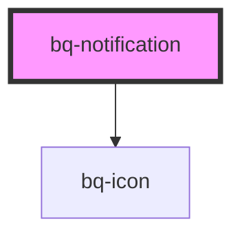

# bq-notification

<!-- Auto Generated Below -->

## Properties

| Property       | Attribute       | Description                                                                                                       | Type                                                       | Default     |
| -------------- | --------------- | ----------------------------------------------------------------------------------------------------------------- | ---------------------------------------------------------- | ----------- |
| `showClose`    | `show-close`    | Set property to false if you want to hide Close icon                                                              | `boolean`                                                  | `undefined` |
| `showIcon`     | `show-icon`     | Set property if you want Notification icon to be shown.                                                           | `boolean`                                                  | `undefined` |
| `subjectColor` | `subject-color` | Set the subject color if you don't want to be black. Subject color will also apply to Icon color if there is one. | `string`                                                   | `undefined` |
| `type`         | `type`          | Type of Notification                                                                                              | `"default" \| "error" \| "info" \| "success" \| "warning"` | `'default'` |

## Methods

### `hide() => Promise<void>`

Trigger function when you want to close Notification

#### Returns

Type: `Promise<void>`

### `show() => Promise<void>`

Trigger function when you want to show Notification

#### Returns

Type: `Promise<void>`

## Shadow Parts

| Part            | Description                                                                                                |
| --------------- | ---------------------------------------------------------------------------------------------------------- |
| `"avatar"`      | `
` container element of notification avatar component slot.  Will be shown if Prop showIcon is false. |
| `"base"`        | The component's internal wrapper of the notification component.                                            |
| `"close-icon"`  | `
` container element of notification close icon component.  Will be shown if Prop showClose is false. |
| `"description"` | `
` container element of notification description slot                                                 |
| `"footer"`      | `
` container element of notification footer slot                                                      |
| `"icon"`        | `
` container element of notification icon component. Will be shown if Prop showIcon is true.          |
| `"title"`       | `
` container element of notification default slot.                                                    |

## Dependencies

### Depends on

- [bq-icon](../icon)

### Graph

----------------------------------------------

*Built with [StencilJS](https://stenciljs.com/)*
