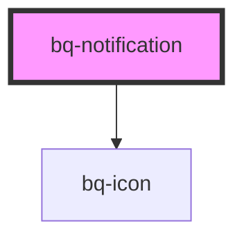

# bq-notification

<!-- Auto Generated Below -->

## Properties

| Property       | Attribute       | Description                                                                                                       | Type      | Default     |
| -------------- | --------------- | ----------------------------------------------------------------------------------------------------------------- | --------- | ----------- |
| `description`  | `description`   | Description text of Notification                                                                                  | `string`  | `undefined` |
| `href`         | `href`          | URL text of Notification description. If you providing URL please make sure it's valid.                           | `string`  | `undefined` |
| `showClose`    | `show-close`    | Set property if to false if you want to hide Close icon                                                           | `boolean` | `undefined` |
| `showIcon`     | `show-icon`     | Set property if you want Notification icon to be shown.                                                           | `boolean` | `undefined` |
| `subjectColor` | `subject-color` | Set the subject color if you don't want to be black. Subject color will also apply to Icon color if there is one. | `string`  | `undefined` |
| `type`         | `type`          | Type of Notification                                                                                              | `string`  | `undefined` |

## Methods

### `hideNotification() => Promise<void>`

Trigger function when you want to close Notification

#### Returns

Type: `Promise<void>`

### `showNotification() => Promise<void>`

Trigger function when you want to show Notification

#### Returns

Type: `Promise<void>`

## Dependencies

### Depends on

- [bq-icon](../icon)

### Graph

----------------------------------------------

*Built with [StencilJS](https://stenciljs.com/)*
