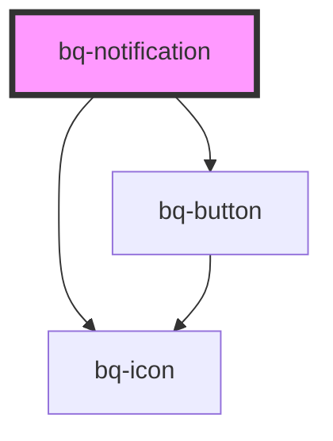

# bq-notification

<!-- Auto Generated Below -->

## Properties

| Property        | Attribute         | Description                                                                                                          | Type                                                       | Default     |
| --------------- | ----------------- | -------------------------------------------------------------------------------------------------------------------- | ---------------------------------------------------------- | ----------- |
| `disableClose`  | `disable-close`   | If rue, the close button at the top right of the notification won't be shown                                         | `boolean`                                                  | `false`     |
| `hasCustomIcon` | `has-custom-icon` | If true, the predefined icon type won't be shown and a custom icon provided on integration will be displayed instead | `boolean`                                                  | `false`     |
| `hideIcon`      | `hide-icon`       | If true, the notification icon won't be shown                                                                        | `boolean`                                                  | `false`     |
| `isOpen`        | `is-open`         | If true, the notification will be shown                                                                              | `boolean`                                                  | `false`     |
| `type`          | `type`            | Type of Notification                                                                                                 | `"default" \| "error" \| "info" \| "success" \| "warning"` | `'default'` |

## Methods

### `hide() => Promise<void>`

Trigger function when you want to close Notification

#### Returns

Type: `Promise<void>`

### `show() => Promise<void>`

Trigger function when you want to show Notification

#### Returns

Type: `Promise<void>`

## Shadow Parts

| Part            | Description                                                                                                |
| --------------- | ---------------------------------------------------------------------------------------------------------- |
| `"avatar"`      | `
` container element of notification avatar component slot.  Will be shown if Prop showIcon is false. |
| `"base"`        | The component's internal wrapper of the notification component.                                            |
| `"body"`        |                                                                                                            |
| `"btn-close"`   |                                                                                                            |
| `"close-icon"`  | `
` container element of notification close icon component.  Will be shown if Prop showClose is false. |
| `"content"`     |                                                                                                            |
| `"description"` | `
` container element of notification description slot                                                 |
| `"footer"`      | `
` container element of notification footer slot                                                      |
| `"icon"`        | `
` container element of notification icon component. Will be shown if Prop showIcon is true.          |
| `"title"`       | `
` container element of notification default slot.                                                    |

## Dependencies

### Depends on

- [bq-button](../button)
- [bq-icon](../icon)

### Graph

----------------------------------------------

*Built with [StencilJS](https://stenciljs.com/)*
