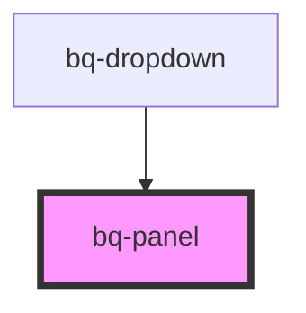

# bq-panel

<!-- Auto Generated Below -->

## Properties

| Property    | Attribute   | Description                                                                                  | Type                                                                                                                                                                 | Default    |
| ----------- | ----------- | -------------------------------------------------------------------------------------------- | -------------------------------------------------------------------------------------------------------------------------------------------------------------------- | ---------- |
| `distance`  | `distance`  | Distance between the panel and the trigger element                                           | `number`                                                                                                                                                             | `0`        |
| `open`      | `open`      | If true, panel is visible. You can toggle this attribute to show/hide the panel.             | `boolean`                                                                                                                                                            | `false`    |
| `placement` | `placement` | Position of the panel                                                                        | `"bottom" \| "bottom-end" \| "bottom-start" \| "left" \| "left-end" \| "left-start" \| "right" \| "right-end" \| "right-start" \| "top" \| "top-end" \| "top-start"` | `'bottom'` |
| `scrollbar` | `scrollbar` | If true, the scrollbar is visible. You can toggle this attribute to show/hide the scrollbar. | `boolean`                                                                                                                                                            | `false`    |

## Events

| Event               | Description                                                                                                           | Type                   |
| ------------------- | --------------------------------------------------------------------------------------------------------------------- | ---------------------- |
| `bqPanelVisibility` | Handler to be called to check if the panel is open or closed. Will emit every time the state of the panel is changed. | `CustomEvent<boolean>` |

## Methods

### `setTriggerElement(trigger: HTMLElement) => Promise<void>`

set trigger element and init FloatingUI

#### Returns

Type: `Promise<void>`

### `togglePanel() => Promise<void>`

#### Returns

Type: `Promise<void>`

## Shadow Parts

| Part     | Description                                                       |
| -------- | ----------------------------------------------------------------- |
| `"base"` | The `div` element which acts as a container for the panel content |

## Dependencies

### Used by

 - [bq-dropdown](../dropdown)

### Graph

----------------------------------------------

*Built with [StencilJS](https://stenciljs.com/)*
