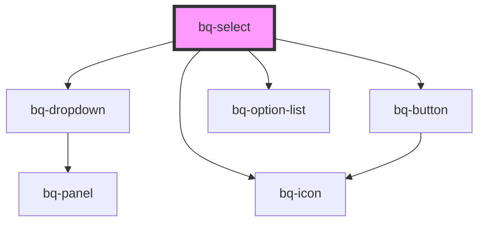

# bq-select

<!-- Auto Generated Below -->

## Properties

| Property            | Attribute            | Description                                                                                                             | Type                                          | Default         |
| ------------------- | -------------------- | ----------------------------------------------------------------------------------------------------------------------- | --------------------------------------------- | --------------- |
| `autofocus`         | `autofocus`          | If true, the Select input will be focused on component render                                                           | `boolean`                                     | `undefined`     |
| `clearButtonLabel`  | `clear-button-label` | The clear button aria label                                                                                             | `string`                                      | `'Clear value'` |
| `disableClear`      | `disable-clear`      | If true, the clear button won't be displayed                                                                            | `boolean`                                     | `false`         |
| `disabled`          | `disabled`           | Indicates whether the Select input is disabled or not. If `true`, the Select is disabled and cannot be interacted with. | `boolean`                                     | `false`         |
| `form`              | `form`               | The ID of the form that the Select input belongs to.                                                                    | `string`                                      | `undefined`     |
| `name` _(required)_ | `name`               | The Select input name.                                                                                                  | `string`                                      | `undefined`     |
| `placeholder`       | `placeholder`        | The Select input placeholder text value                                                                                 | `string`                                      | `undefined`     |
| `readonly`          | `readonly`           | If true, the Select input cannot be modified.                                                                           | `boolean`                                     | `undefined`     |
| `required`          | `required`           | Indicates whether or not the Select input is required to be filled out before submitting the form.                      | `boolean`                                     | `undefined`     |
| `validationStatus`  | `validation-status`  | The validation status of the Select input.                                                                              | `"error" \| "none" \| "success" \| "warning"` | `'none'`        |
| `value`             | `value`              | The select input value, it can be used to reset the field to a previous value                                           | `number \| string \| string[]`                | `undefined`     |

## Events

| Event      | Description                                                                                   | Type                                                                             |
| ---------- | --------------------------------------------------------------------------------------------- | -------------------------------------------------------------------------------- |
| `bqBlur`   | Callback handler emitted when the Select input loses focus                                    | `CustomEvent<HTMLBqSelectElement>`                                               |
| `bqChange` | Callback handler emitted when the selected value has changed and the Select input loses focus | `CustomEvent<{ value: string \| number \| string[]; el: HTMLBqSelectElement; }>` |
| `bqClear`  | Callback handler emitted when the selected value has been cleared                             | `CustomEvent<HTMLBqSelectElement>`                                               |
| `bqFocus`  | Callback handler emitted when the Select input has received focus                             | `CustomEvent<HTMLBqSelectElement>`                                               |

## Shadow Parts

| Part            | Description                                                     |
| --------------- | --------------------------------------------------------------- |
| `"base"`        | The component's base wrapper.                                   |
| `"button"`      | The native HTML button used under the hood in the clear button. |
| `"clear-btn"`   | The clear button.                                               |
| `"control"`     | The input control wrapper.                                      |
| `"helper-text"` | The helper text slot container.                                 |
| `"input"`       | The native HTML input element used under the hood.              |
| `"label"`       | The label slot container.                                       |
| `"panel"`       | The select panel container                                      |
| `"prefix"`      | The prefix slot container.                                      |
| `"suffix"`      | The suffix slot container.                                      |

## Dependencies

### Depends on

- [bq-dropdown](../dropdown)
- [bq-button](../button)
- [bq-icon](../icon)
- [bq-option-list](../option-list)

### Graph

----------------------------------------------

*Built with [StencilJS](https://stenciljs.com/)*
