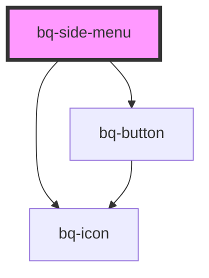

# bq-menu

<!-- Auto Generated Below -->

## Overview

A menu is like a widget that offers a list of choices to the user.

## Properties

| Property          | Attribute          | Description                                                          | Type                              | Default    |
| ----------------- | ------------------ | -------------------------------------------------------------------- | --------------------------------- | ---------- |
| `collapsed`       | `collapsed`        | Show menu as collapsed. Relevant only if `show-collapsible` is true. | `boolean`                         | `true`     |
| `showCollapsible` | `show-collapsible` | Show/hide footer (collapse option).                                  | `boolean`                         | `true`     |
| `size`            | `size`             | Set menu item size (small/medium).                                   | `"medium" \| "small"`             | `'medium'` |
| `theme`           | `theme`            | Set theme.                                                           | `"brand" \| "inverse" \| "light"` | `'light'`  |

## Events

| Event      | Description                                                    | Type                                     |
| ---------- | -------------------------------------------------------------- | ---------------------------------------- |
| `bqBlur`   | Handler to be called when the item loses focus                 | `CustomEvent<HTMLBqSideMenuItemElement>` |
| `bqClick`  | Handler to be called when item is clicked                      | `CustomEvent<HTMLBqSideMenuItemElement>` |
| `bqFocus`  | Handler to be called when the item gets focus                  | `CustomEvent<HTMLBqSideMenuItemElement>` |
| `bqSelect` | Handler to be called when item is selected (on click/on Enter) | `CustomEvent<HTMLBqSideMenuItemElement>` |

## Shadow Parts

| Part              | Description                                                                                      |
| ----------------- | ------------------------------------------------------------------------------------------------ |
| `"content"`       | The `span` tag element used to display the content of the menu (bq-menu-item components).        |
| `"footer"`        | The `span` tag element used to display the `footer` with the collapsible element.                |
| `"group"`         | The `aside` tag element used to group the menu item elements.                                    |
| `"header"`        | The `span` tag element used to display the header part of the menu. Wrapper for prefix & suffix. |
| `"header-prefix"` | The `span` tag element used to display the header part of the menu (bq-icon).                    |
| `"header-suffix"` | The `span` tag element used to display the header part of the menu (title).                      |

## Dependencies

### Depends on

- [bq-button](../button)
- [bq-icon](../icon)

### Graph

----------------------------------------------

*Built with [StencilJS](https://stenciljs.com/)*
