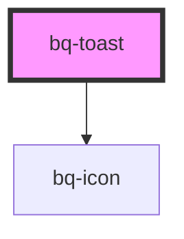

# bq-toast

<!-- Auto Generated Below -->

## Properties

| Property        | Attribute         | Description                            | Type                                                                  | Default     |
| --------------- | ----------------- | -------------------------------------- | --------------------------------------------------------------------- | ----------- |
| `autoCloseTime` | `auto-close-time` | Should hide Toast after period of time | `number`                                                              | `undefined` |
| `showIcon`      | `show-icon`       | Should show icon of Toast              | `boolean`                                                             | `false`     |
| `textColor`     | `text-color`      | Text color of Toast                    | `string`                                                              | `undefined` |
| `type`          | `type`            | Type of Toast                          | `"alert" \| "default" \| "error" \| "info" \| "loading" \| "success"` | `'default'` |

## Methods

### `hideToast() => Promise<void>`

Triggers function to hide toast

#### Returns

Type: `Promise<void>`

### `showToast() => Promise<void>`

Triggers function to show toast

#### Returns

Type: `Promise<void>`

## Shadow Parts

| Part     | Description                                              |
| -------- | -------------------------------------------------------- |
| `"base"` | The component's internal wrapper of the Toast component. |
| `"icon"` | `
` container element of toast icon component.       |
| `"text"` | `
` container element of toast text slot.            |

## Dependencies

### Depends on

- [bq-icon](../icon)

### Graph

----------------------------------------------

*Built with [StencilJS](https://stenciljs.com/)*
