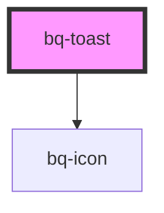

# bq-toast

<!-- Auto Generated Below -->

## Properties

| Property    | Attribute    | Description               | Type                                                                  | Default     |
| ----------- | ------------ | ------------------------- | --------------------------------------------------------------------- | ----------- |
| `showIcon`  | `show-icon`  | Should show icon of Toast | `boolean`                                                             | `true`      |
| `textColor` | `text-color` | Text color of Toast       | `string`                                                              | `undefined` |
| `type`      | `type`       | Type of Toast             | `"alert" \| "default" \| "error" \| "info" \| "loading" \| "success"` | `'default'` |

## Methods

### `hideToast() => Promise<void>`

Trigers function to hide toast

#### Returns

Type: `Promise<void>`

### `showToast() => Promise<void>`

Trigers function to show toast

#### Returns

Type: `Promise<void>`

## Shadow Parts

| Part     | Description |
| -------- | ----------- |
| `"icon"` |             |

## Dependencies

### Depends on

- [bq-icon](../icon)

### Graph

----------------------------------------------

*Built with [StencilJS](https://stenciljs.com/)*
