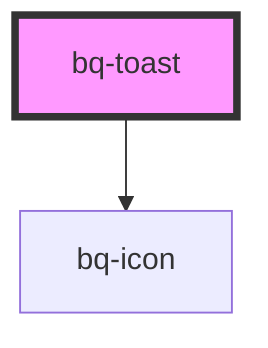

# bq-toast

<!-- Auto Generated Below -->

## Properties

| Property    | Attribute   | Description                                                                  | Type                                                                                              | Default           |
| ----------- | ----------- | ---------------------------------------------------------------------------- | ------------------------------------------------------------------------------------------------- | ----------------- |
| `hideIcon`  | `hide-icon` | If true will hide toast icon                                                 | `boolean`                                                                                         | `false`           |
| `open`      | `open`      | If true, the toast will be shown                                             | `boolean`                                                                                         | `undefined`       |
| `placement` | `placement` | Placement of toast                                                           | `"bottom-center" \| "bottom-left" \| "bottom-right" \| "top-center" \| "top-left" \| "top-right"` | `'bottom-center'` |
| `time`      | `time`      | The length of time, in milliseconds, after which the toast will close itself | `number`                                                                                          | `3000`            |
| `type`      | `type`      | Type of toast                                                                | `"alert" \| "custom" \| "error" \| "info" \| "loading" \| "success"`                              | `'info'`          |

## Events

| Event    | Description                                                   | Type                              |
| -------- | ------------------------------------------------------------- | --------------------------------- |
| `bqHide` | Callback handler to be called when the notification is hidden | `CustomEvent<HTMLBqToastElement>` |
| `bqShow` | Callback handler to be called when the notification is shown  | `CustomEvent<HTMLBqToastElement>` |

## Methods

### `hide() => Promise<void>`

#### Returns

Type: `Promise<void>`

### `show() => Promise<void>`

#### Returns

Type: `Promise<void>`

### `toast() => Promise<void>`

#### Returns

Type: `Promise<void>`

## Shadow Parts

| Part     | Description                                              |
| -------- | -------------------------------------------------------- |
| `"base"` | The component's internal wrapper of the Toast component. |
| `"icon"` | `
` container element of toast icon component.       |

## Dependencies

### Depends on

- [bq-icon](../icon)

### Graph

----------------------------------------------

*Built with [StencilJS](https://stenciljs.com/)*
