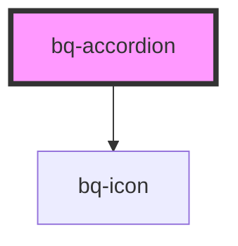

# bq-accordion

<!-- Auto Generated Below -->

## Properties

| Property     | Attribute    | Description | Type                  | Default    |
| ------------ | ------------ | ----------- | --------------------- | ---------- |
| `appearance` | `appearance` |             | `"filled" \| "ghost"` | `'filled'` |
| `expanded`   | `expanded`   |             | `boolean`             | `false`    |
| `size`       | `size`       |             | `"medium" \| "small"` | `'medium'` |

## Shadow Parts

| Part       | Description                                             |
| ---------- | ------------------------------------------------------- |
| `"base"`   | The `
` that holds the accordion content        |
| `"header"` | The `
` that holds the accordion header content |
| `"text"`   | The `` that holds the accordion header text       |

## Dependencies

### Depends on

- [bq-icon](../icon)

### Graph

----------------------------------------------

*Built with [StencilJS](https://stenciljs.com/)*
