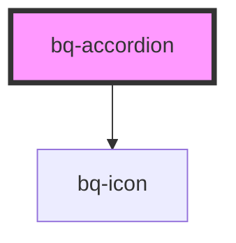

# bq-accordion

<!-- Auto Generated Below -->

## Properties

| Property     | Attribute    | Description | Type                  | Default    |
| ------------ | ------------ | ----------- | --------------------- | ---------- |
| `appearance` | `appearance` |             | `"filled" \| "ghost"` | `'filled'` |
| `disabled`   | `disabled`   |             | `boolean`             | `false`    |
| `expanded`   | `expanded`   |             | `boolean`             | `false`    |
| `rotate`     | `rotate`     |             | `boolean`             | `false`    |
| `size`       | `size`       |             | `"medium" \| "small"` | `'medium'` |

## Events

| Event     | Description                                         | Type                                  |
| --------- | --------------------------------------------------- | ------------------------------------- |
| `bqBlur`  | Handler to be called when the accordion loses focus | `CustomEvent<HTMLBqAccordionElement>` |
| `bqClick` | Handler to be called when the accordion is clicked  | `CustomEvent<HTMLBqAccordionElement>` |
| `bqFocus` | Handler to be called when the accordion gets focus  | `CustomEvent<HTMLBqAccordionElement>` |

## Shadow Parts

| Part       | Description                                                    |
| ---------- | -------------------------------------------------------------- |
| `"base"`   | The `
` that holds the accordion content               |
| `"header"` | The `
` that holds the accordion header content        |
| `"panel"`  | The `
` that holds the accordion panel content             |
| `"prefix"` | The `
` that holds the accordion text prefix icon / avatar |
| `"suffix"` | The `
` that holds the accordion text suffix icon          |
| `"text"`   | The `
` that holds the accordion header text               |

## Dependencies

### Depends on

- [bq-icon](../icon)

### Graph

----------------------------------------------

*Built with [StencilJS](https://stenciljs.com/)*
