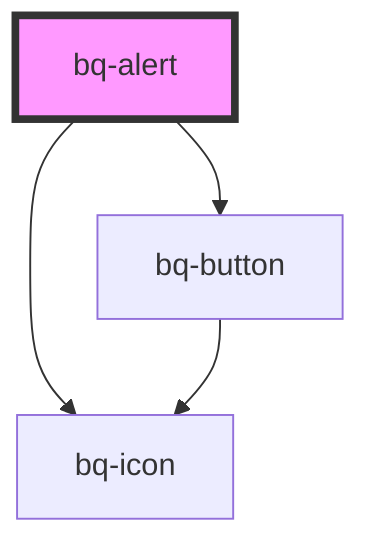

# bq-alert

<!-- Auto Generated Below -->

## Properties

| Property       | Attribute       | Description                                                            | Type                                                      | Default     |
| -------------- | --------------- | ---------------------------------------------------------------------- | --------------------------------------------------------- | ----------- |
| `disableClose` | `disable-close` | If true, the close button at the top right of the alert won't be shown | `boolean`                                                 | `undefined` |
| `hideIcon`     | `hide-icon`     | If true, the alert icon won't be shown                                 | `boolean`                                                 | `undefined` |
| `open`         | `open`          | If true, the alert will be shown                                       | `boolean`                                                 | `undefined` |
| `type`         | `type`          | Type of Alert                                                          | `"custom" \| "error" \| "info" \| "success" \| "warning"` | `'info'`    |

## Shadow Parts

| Part             | Description |
| ---------------- | ----------- |
| `"btn-close"`    |             |
| `"content"`      |             |
| `"icon"`         |             |
| `"icon-outline"` |             |
| `"main"`         |             |
| `"title"`        |             |
| `"wrapper"`      |             |

## Dependencies

### Depends on

- [bq-button](../button)
- [bq-icon](../icon)

### Graph

----------------------------------------------

*Built with [StencilJS](https://stenciljs.com/)*
