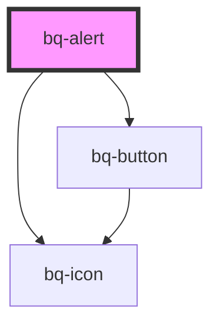

# bq-alert

<!-- Auto Generated Below -->

## Properties

| Property       | Attribute       | Description                                                                                                      | Type                                                       | Default     |
| -------------- | --------------- | ---------------------------------------------------------------------------------------------------------------- | ---------------------------------------------------------- | ----------- |
| `autoDismiss`  | `auto-dismiss`  | If true, the alert will automatically hide after the specified amount of time                                    | `boolean`                                                  | `undefined` |
| `disableClose` | `disable-close` | If true, the close button at the top right of the alert won't be shown                                           | `boolean`                                                  | `undefined` |
| `hideIcon`     | `hide-icon`     | If true, the alert icon won't be shown                                                                           | `boolean`                                                  | `undefined` |
| `open`         | `open`          | If true, the alert will be shown                                                                                 | `boolean`                                                  | `undefined` |
| `sticky`       | `sticky`        | If true, the alert component will remain fixed at the top of the page, occupying the full viewport               | `boolean`                                                  | `undefined` |
| `time`         | `time`          | The length of time, in milliseconds, after which the alert will close itself. Only valid if `autoDismiss="true"` | `number`                                                   | `3000`      |
| `type`         | `type`          | Type of Alert                                                                                                    | `"default" \| "error" \| "info" \| "success" \| "warning"` | `'default'` |

## Events

| Event    | Description                                                   | Type               |
| -------- | ------------------------------------------------------------- | ------------------ |
| `bqHide` | Callback handler to be called when the notification is hidden | `CustomEvent<any>` |
| `bqShow` | Callback handler to be called when the notification is shown  | `CustomEvent<any>` |

## Methods

### `hide() => Promise<void>`

Method to be called to hide the alert component

#### Returns

Type: `Promise<void>`

### `show() => Promise<void>`

Method to be called to show the alert component

#### Returns

Type: `Promise<void>`

## Shadow Parts

| Part             | Description                                                                                                               |
| ---------------- | ------------------------------------------------------------------------------------------------------------------------- |
| `"base"`         | The `
` container of the predefined bq-icon component                                                                 |
| `"body"`         | The container `
` that wraps the alert description content                                                            |
| `"btn-close"`    | The `bq-button` used to close the alert                                                                                   |
| `"content"`      | The container `
` that wraps all the alert content (title, description, footer)                                       |
| `"footer"`       | The container `
` that wraps the alert footer content                                                                 |
| `"icon"`         | The `<bq-icon>` element used to render a predefined icon based on the alert type (info, success, warning, error, default) |
| `"icon-outline"` | The container `
` that wraps the icon element                                                                         |
| `"main"`         | The container `
` that wraps the alert main content (title, description)                                              |
| `"svg"`          | The `<svg>` element of the predefined bq-icon component                                                                   |
| `"title"`        | The container `
` that wraps the alert title content                                                                  |
| `"wrapper"`      | The wrapper container `
` of the element inside the shadow DOM                                                        |

## Dependencies

### Depends on

- [bq-button](../button)
- [bq-icon](../icon)

### Graph

----------------------------------------------

*Built with [StencilJS](https://stenciljs.com/)*
