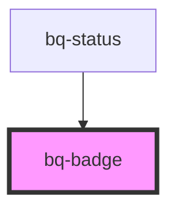

# bq-badge

<!-- Auto Generated Below -->

## Overview

The Badge component is a visual indicator that can be added to various elements within a user interface.
It is typically used to highlight important or relevant information, such as alerts, notifications, or statuses.

## Properties

| Property          | Attribute          | Description                                                                    | Type                  | Default           |
| ----------------- | ------------------ | ------------------------------------------------------------------------------ | --------------------- | ----------------- |
| `backgroundColor` | `background-color` | Badge background color. The value should be a valid value of the palette color | `string`              | `'ui--danger'`    |
| `size`            | `size`             | The size of the badge. Relevant if badge has no content.                       | `"medium" \| "small"` | `'small'`         |
| `textColor`       | `text-color`       | Badge number color. The value should be a valid value of the palette color     | `string`              | `'text--inverse'` |

## Slots

| Slot | Description                                                                                  |
| ---- | -------------------------------------------------------------------------------------------- |
|      | The default slot is used to add content to the badge. The content can be a number or a text. |

## Shadow Parts

| Part       | Description                                            |
| ---------- | ------------------------------------------------------ |
| `"base"`   | The component's internal wrapper that holds the count. |
| `"number"` | The component's internal wrapper that holds the slot.  |

## Dependencies

### Used by

 - [bq-status](../status)

### Graph

----------------------------------------------

*Built with [StencilJS](https://stenciljs.com/)*
