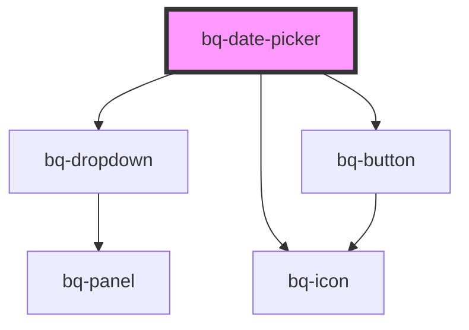

# bq-date-picker

<!-- Auto Generated Below -->

## Properties

| Property            | Attribute             | Description                                                                                                                                                                            | Type                                                                                                                                                                 | Default          |
| ------------------- | --------------------- | -------------------------------------------------------------------------------------------------------------------------------------------------------------------------------------- | -------------------------------------------------------------------------------------------------------------------------------------------------------------------- | ---------------- |
| `autofocus`         | `autofocus`           | If `true`, the Date picker input will be focused on component render                                                                                                                   | `boolean`                                                                                                                                                            | `undefined`      |
| `clearButtonLabel`  | `clear-button-label`  | The clear button aria label                                                                                                                                                            | `string`                                                                                                                                                             | `'Clear value'`  |
| `disableClear`      | `disable-clear`       | If `true`, the clear button won't be displayed                                                                                                                                         | `boolean`                                                                                                                                                            | `false`          |
| `disabled`          | `disabled`            | Indicates whether the Date picker input is disabled or not. If `true`, the Date picker is disabled and cannot be interacted with.                                                      | `boolean`                                                                                                                                                            | `false`          |
| `distance`          | `distance`            | Represents the distance (gutter or margin) between the Date picker panel and the input element.                                                                                        | `number`                                                                                                                                                             | `8`              |
| `firstDayOfWeek`    | `first-day-of-week`   | The first day of the week, where Sunday is 0, Monday is 1, etc                                                                                                                         | `number`                                                                                                                                                             | `1`              |
| `form`              | `form`                | The ID of the form that the Date picker input belongs to.                                                                                                                              | `string`                                                                                                                                                             | `undefined`      |
| `keepOpenOnSelect`  | `keep-open-on-select` | If `true`, the Date picker panel will remain open after a selection date is made.                                                                                                      | `boolean`                                                                                                                                                            | `false`          |
| `locale`            | `locale`              | The locale for formatting dates. If not set, will use the browser's locale                                                                                                             | `string`                                                                                                                                                             | `undefined`      |
| `max`               | `max`                 | The latest date that can be selected                                                                                                                                                   | `string`                                                                                                                                                             | `undefined`      |
| `min`               | `min`                 | The earliest date that can be selected                                                                                                                                                 | `string`                                                                                                                                                             | `undefined`      |
| `months`            | `months`              | Number of months to show when range is `true`                                                                                                                                          | `number`                                                                                                                                                             | `undefined`      |
| `name` _(required)_ | `name`                | The Date picker input name.                                                                                                                                                            | `string`                                                                                                                                                             | `undefined`      |
| `open`              | `open`                | If `true`, the Date picker panel will be visible.                                                                                                                                      | `boolean`                                                                                                                                                            | `false`          |
| `panelHeight`       | `panel-height`        | When set, it will override the height of the Date picker panel.                                                                                                                        | `string`                                                                                                                                                             | `'auto'`         |
| `placeholder`       | `placeholder`         | The Date picker input placeholder text value                                                                                                                                           | `string`                                                                                                                                                             | `undefined`      |
| `placement`         | `placement`           | Position of the Date picker panel                                                                                                                                                      | `"bottom" \| "bottom-end" \| "bottom-start" \| "left" \| "left-end" \| "left-start" \| "right" \| "right-end" \| "right-start" \| "top" \| "top-end" \| "top-start"` | `'bottom-start'` |
| `range`             | `range`               | If `true`, the Date picker panel will accepts more than 1 month to display                                                                                                             | `boolean`                                                                                                                                                            | `false`          |
| `required`          | `required`            | Indicates whether or not the Date picker input is required to be filled out before submitting the form.                                                                                | `boolean`                                                                                                                                                            | `undefined`      |
| `showOutsideDays`   | `show-outside-days`   | Whether to show days outside the month                                                                                                                                                 | `boolean`                                                                                                                                                            | `false`          |
| `skidding`          | `skidding`            | Represents the skidding between the Date picker panel and the input element.                                                                                                           | `number`                                                                                                                                                             | `0`              |
| `strategy`          | `strategy`            | Defines the strategy to position the Date picker panel                                                                                                                                 | `"absolute" \| "fixed"`                                                                                                                                              | `'fixed'`        |
| `validationStatus`  | `validation-status`   | The validation status of the Select input.                                                                                                                                             | `"error" \| "none" \| "success" \| "warning"`                                                                                                                        | `'none'`         |
| `value`             | `value`               | The select input value represents the currently selected date or range and can be used to reset the field to a previous value. All dates are expected in ISO-8601 format (YYYY-MM-DD). | `number \| string \| string[]`                                                                                                                                       | `undefined`      |

## Events

| Event      | Description                                                                                                                                                                                                                    | Type                                                                            |
| ---------- | ------------------------------------------------------------------------------------------------------------------------------------------------------------------------------------------------------------------------------ | ------------------------------------------------------------------------------- |
| `bqBlur`   | Callback handler emitted when the input loses focus                                                                                                                                                                            | `CustomEvent<HTMLBqInputElement>`                                               |
| `bqChange` | Callback handler emitted when the input value has changed and the input loses focus. This handler is called whenever the user finishes typing or pasting text into the input field and then clicks outside of the input field. | `CustomEvent<{ value: string \| number \| string[]; el: HTMLBqInputElement; }>` |
| `bqClear`  | Callback handler emitted when the input value has been cleared                                                                                                                                                                 | `CustomEvent<HTMLBqInputElement>`                                               |
| `bqFocus`  | Callback handler emitted when the input has received focus                                                                                                                                                                     | `CustomEvent<HTMLBqInputElement>`                                               |
| `bqInput`  | Callback handler emitted when the input value changes. This handler is called whenever the user types or pastes text into the input field.                                                                                     | `CustomEvent<{ value: string \| number \| string[]; el: HTMLBqInputElement; }>` |

## Methods

### `clear() => Promise<void>`

Clears the selected value.

#### Returns

Type: `Promise<void>`

## Shadow Parts

| Part          | Description                                                     |
| ------------- | --------------------------------------------------------------- |
| `"base"`      | The component's base wrapper.                                   |
| `"button"`    | The native HTML button used under the hood in the clear button. |
| `"clear-btn"` | The clear button.                                               |
| `"control"`   | The input control wrapper.                                      |
| `"input"`     | The native HTML input element used under the hood.              |
| `"label"`     | The label slot container.                                       |
| `"panel"`     | The date picker panel container                                 |
| `"prefix"`    | The prefix slot container.                                      |
| `"suffix"`    | The suffix slot container.                                      |

## Dependencies

### Depends on

- [bq-dropdown](../dropdown)
- [bq-button](../button)
- [bq-icon](../icon)

### Graph

----------------------------------------------

*Built with [StencilJS](https://stenciljs.com/)*
