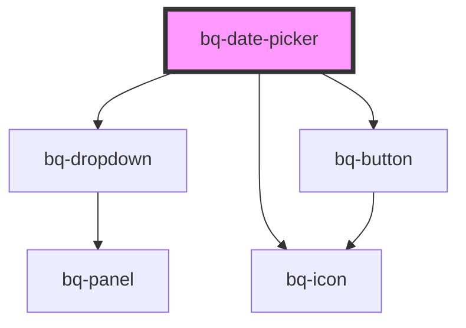

# bq-date-picker

<!-- Auto Generated Below -->

## Overview

The Date Picker is a intuitive UI element component allows users to select dates from a visual calendar interface, providing an intuitive way to input date information.

## Properties

| Property                | Attribute                  | Description | Type                                                                                                                                                                 | Default                                               |
| ----------------------- | -------------------------- | ----------- | -------------------------------------------------------------------------------------------------------------------------------------------------------------------- | ----------------------------------------------------- |
| `allowHeaderViewToggle` | `allow-header-view-toggle` |             | `boolean`                                                                                                                                                            | `false`                                               |
| `autofocus`             | `autofocus`                |             | `boolean`                                                                                                                                                            | `undefined`                                           |
| `calendarView`          | `calendar-view`            |             | `"days" \| "decades" \| "months" \| "years"`                                                                                                                         | `'days'`                                              |
| `clearButtonLabel`      | `clear-button-label`       |             | `string`                                                                                                                                                             | `'Clear value'`                                       |
| `disableClear`          | `disable-clear`            |             | `boolean`                                                                                                                                                            | `false`                                               |
| `disabled`              | `disabled`                 |             | `boolean`                                                                                                                                                            | `false`                                               |
| `distance`              | `distance`                 |             | `number`                                                                                                                                                             | `8`                                                   |
| `firstDayOfWeek`        | `first-day-of-week`        |             | `0 \| 1 \| 2 \| 3 \| 4 \| 5 \| 6`                                                                                                                                    | `1`                                                   |
| `form`                  | `form`                     |             | `string`                                                                                                                                                             | `undefined`                                           |
| `formValidationMessage` | `form-validation-message`  |             | `string`                                                                                                                                                             | `undefined`                                           |
| `formatOptions`         | `format-options`           |             | `DateTimeFormatOptions`                                                                                                                                              | `{ day: 'numeric', month: 'short', year: 'numeric' }` |
| `isDateDisallowed`      | `is-date-disallowed`       |             | `(date: Date) => boolean`                                                                                                                                            | `undefined`                                           |
| `locale`                | `locale`                   |             | `Locale \| readonly (string \| Locale)[] \| string`                                                                                                                  | `'en-GB'`                                             |
| `max`                   | `max`                      |             | `string`                                                                                                                                                             | `undefined`                                           |
| `min`                   | `min`                      |             | `string`                                                                                                                                                             | `undefined`                                           |
| `months`                | `months`                   |             | `number`                                                                                                                                                             | `undefined`                                           |
| `monthsPerView`         | `months-per-view`          |             | `"months" \| "single"`                                                                                                                                               | `'single'`                                            |
| `name` _(required)_     | `name`                     |             | `string`                                                                                                                                                             | `undefined`                                           |
| `open`                  | `open`                     |             | `boolean`                                                                                                                                                            | `false`                                               |
| `panelHeight`           | `panel-height`             |             | `string`                                                                                                                                                             | `'auto'`                                              |
| `placeholder`           | `placeholder`              |             | `string`                                                                                                                                                             | `undefined`                                           |
| `placement`             | `placement`                |             | `"bottom" \| "bottom-end" \| "bottom-start" \| "left" \| "left-end" \| "left-start" \| "right" \| "right-end" \| "right-start" \| "top" \| "top-end" \| "top-start"` | `'bottom-end'`                                        |
| `required`              | `required`                 |             | `boolean`                                                                                                                                                            | `undefined`                                           |
| `showOutsideDays`       | `show-outside-days`        |             | `boolean`                                                                                                                                                            | `false`                                               |
| `skidding`              | `skidding`                 |             | `number`                                                                                                                                                             | `0`                                                   |
| `strategy`              | `strategy`                 |             | `"absolute" \| "fixed"`                                                                                                                                              | `'fixed'`                                             |
| `tentative`             | `tentative`                |             | `string`                                                                                                                                                             | `undefined`                                           |
| `type`                  | `type`                     |             | `"multi" \| "range" \| "single"`                                                                                                                                     | `'single'`                                            |
| `validationStatus`      | `validation-status`        |             | `"error" \| "none" \| "success" \| "warning"`                                                                                                                        | `'none'`                                              |
| `value`                 | `value`                    |             | `string`                                                                                                                                                             | `undefined`                                           |

## Events

| Event      | Description | Type                                                           |
| ---------- | ----------- | -------------------------------------------------------------- |
| `bqBlur`   |             | `CustomEvent<HTMLBqDatePickerElement>`                         |
| `bqChange` |             | `CustomEvent<{ value: string; el: HTMLBqDatePickerElement; }>` |
| `bqClear`  |             | `CustomEvent<HTMLBqDatePickerElement>`                         |
| `bqFocus`  |             | `CustomEvent<HTMLBqDatePickerElement>`                         |

## Methods

### `clear() => Promise<void>`

#### Returns

Type: `Promise<void>`

## Shadow Parts

| Part                      | Description                                                       |
| ------------------------- | ----------------------------------------------------------------- |
| `"base"`                  | The component's base wrapper.                                     |
| `"button"`                | The native HTML button used under the hood in the clear button.   |
| `"calendar__button"`      | Any button used in the calendar-month component.                  |
| `"calendar__container"`   | The calendar-range container for the entire component.            |
| `"calendar__day"`         | The buttons corresponding to each day in the calendar-month grid. |
| `"calendar__disabled"`    | A button that is disabled due to min/max.                         |
| `"calendar__disallowed"`  | Any day that has been disallowed via isDateDisallowed.            |
| `"calendar__head"`        | The calendar-month table's header row.                            |
| `"calendar__header"`      | The calendar-range container for the heading and buttons.         |
| `"calendar__heading"`     | The calendar-month heading container.                             |
| `"calendar__next"`        | The next page button.                                             |
| `"calendar__outside"`     | Any days which are outside the current month.                     |
| `"calendar__previous"`    | The previous page button.                                         |
| `"calendar__range-end"`   | The day at the end of a date range.                               |
| `"calendar__range-inner"` | Any days between the start and end of a date range.               |
| `"calendar__range-start"` | The day at the start of a date range.                             |
| `"calendar__selected"`    | Any days which are selected.                                      |
| `"calendar__table"`       | The calendar-month table element.                                 |
| `"calendar__td"`          | The calendar-month table's body cells.                            |
| `"calendar__th"`          | The calendar-month table's header cells.                          |
| `"calendar__today"`       | The Today's day.                                                  |
| `"calendar__tr"`          | Any row within the table.                                         |
| `"calendar__week"`        | The calendar-month table's body rows.                             |
| `"clear-btn"`             | The clear button.                                                 |
| `"control"`               | The input control wrapper.                                        |
| `"input"`                 | The native HTML input element.                                    |
| `"label"`                 | The label slot container.                                         |
| `"panel"`                 | The date picker panel container                                   |
| `"prefix"`                | The prefix slot container.                                        |
| `"suffix"`                | The suffix slot container.                                        |

## Dependencies

### Depends on

- [bq-dropdown](../dropdown)
- [bq-icon](../icon)
- [bq-button](../button)

### Graph

----------------------------------------------

*Built with [StencilJS](https://stenciljs.com/)*
