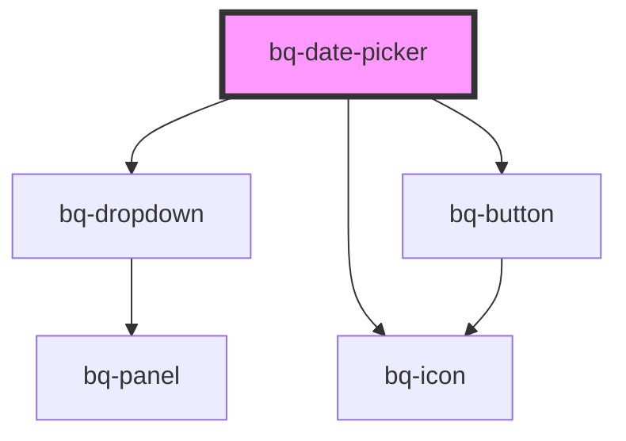

# bq-date-picker

<!-- Auto Generated Below -->

## Overview

The Date Picker is a intuitive UI element component allows users to select dates from a visual calendar interface, providing an intuitive way to input date information.

## Properties

| Property                | Attribute                 | Description                                                                                                                                                                                                            | Type                                                                                                                                                                 | Default                                                              |
| ----------------------- | ------------------------- | ---------------------------------------------------------------------------------------------------------------------------------------------------------------------------------------------------------------------- | -------------------------------------------------------------------------------------------------------------------------------------------------------------------- | -------------------------------------------------------------------- |
| `autofocus`             | `autofocus`               | If `true`, the Date picker input will be focused on component render                                                                                                                                                   | `boolean`                                                                                                                                                            | `undefined`                                                          |
| `clearButtonLabel`      | `clear-button-label`      | The clear button aria label                                                                                                                                                                                            | `string`                                                                                                                                                             | `'Clear value'`                                                      |
| `disableClear`          | `disable-clear`           | If `true`, the clear button won't be displayed                                                                                                                                                                         | `boolean`                                                                                                                                                            | `false`                                                              |
| `disabled`              | `disabled`                | Indicates whether the Date picker input is disabled or not. If `true`, the Date picker is disabled and cannot be interacted with.                                                                                      | `boolean`                                                                                                                                                            | `false`                                                              |
| `distance`              | `distance`                | Represents the distance (gutter or margin) between the Date picker panel and the input element.                                                                                                                        | `number`                                                                                                                                                             | `8`                                                                  |
| `firstDayOfWeek`        | `first-day-of-week`       | The first day of the week, where Sunday is 0, Monday is 1, etc                                                                                                                                                         | `0 \| 1 \| 2 \| 3 \| 4 \| 5 \| 6`                                                                                                                                    | `1`                                                                  |
| `form`                  | `form`                    | The ID of the form that the Date picker input belongs to.                                                                                                                                                              | `string`                                                                                                                                                             | `undefined`                                                          |
| `formValidationMessage` | `form-validation-message` | The native form validation message (mandatory if `required` is set)                                                                                                                                                    | `string`                                                                                                                                                             | `undefined`                                                          |
| `formatOptions`         | --                        | The options to use when formatting the displayed value. Details: https://developer.mozilla.org/en-US/docs/Web/JavaScript/Reference/Global_Objects/Intl/DateTimeFormat#using_options                                    | `DateTimeFormatOptions`                                                                                                                                              | `{     day: 'numeric',     month: 'short',     year: 'numeric',   }` |
| `isDateDisallowed`      | --                        | A function that takes a date and returns true if the date should not be selectable                                                                                                                                     | `(date: Date) => boolean`                                                                                                                                            | `undefined`                                                          |
| `locale`                | `locale`                  | The locale for formatting dates. If not set, will use the browser's locale. Details: https://developer.mozilla.org/en-US/docs/Web/JavaScript/Reference/Global_Objects/Intl#locales_argument                            | `Locale \| readonly (string \| Locale)[] \| string`                                                                                                                  | `'en-GB'`                                                            |
| `max`                   | `max`                     | The latest date that can be selected                                                                                                                                                                                   | `string`                                                                                                                                                             | `undefined`                                                          |
| `min`                   | `min`                     | The earliest date that can be selected                                                                                                                                                                                 | `string`                                                                                                                                                             | `undefined`                                                          |
| `months`                | `months`                  | Number of months to show when range is `true`                                                                                                                                                                          | `number`                                                                                                                                                             | `undefined`                                                          |
| `monthsPerView`         | `months-per-view`         | Specifies how the next/previous buttons should navigate the calendar. - single: The buttons will navigate by a single month at a time. - months: The buttons will navigate by the number of months displayed per view. | `"months" \| "single"`                                                                                                                                               | `'single'`                                                           |
| `name` _(required)_     | `name`                    | The Date picker input name.                                                                                                                                                                                            | `string`                                                                                                                                                             | `undefined`                                                          |
| `open`                  | `open`                    | If `true`, the Date picker panel will be visible.                                                                                                                                                                      | `boolean`                                                                                                                                                            | `false`                                                              |
| `panelHeight`           | `panel-height`            | When set, it will override the height of the Date picker panel.                                                                                                                                                        | `string`                                                                                                                                                             | `'auto'`                                                             |
| `placeholder`           | `placeholder`             | The Date picker input placeholder text value                                                                                                                                                                           | `string`                                                                                                                                                             | `undefined`                                                          |
| `placement`             | `placement`               | Position of the Date picker panel                                                                                                                                                                                      | `"bottom" \| "bottom-end" \| "bottom-start" \| "left" \| "left-end" \| "left-start" \| "right" \| "right-end" \| "right-start" \| "top" \| "top-end" \| "top-start"` | `'bottom-end'`                                                       |
| `required`              | `required`                | Indicates whether or not the Date picker input is required to be filled out before submitting the form.                                                                                                                | `boolean`                                                                                                                                                            | `undefined`                                                          |
| `showOutsideDays`       | `show-outside-days`       | Whether to show days outside the month                                                                                                                                                                                 | `boolean`                                                                                                                                                            | `false`                                                              |
| `skidding`              | `skidding`                | Represents the skidding between the Date picker panel and the input element.                                                                                                                                           | `number`                                                                                                                                                             | `0`                                                                  |
| `strategy`              | `strategy`                | Defines the strategy to position the Date picker panel                                                                                                                                                                 | `"absolute" \| "fixed"`                                                                                                                                              | `'fixed'`                                                            |
| `tentative`             | `tentative`               | The date that is tentatively selected e.g. the start of a range selection                                                                                                                                              | `string`                                                                                                                                                             | `undefined`                                                          |
| `type`                  | `type`                    | It defines how the calendar will behave, allowing single date selection, range selection, or multiple date selection                                                                                                   | `"multi" \| "range" \| "single"`                                                                                                                                     | `'single'`                                                           |
| `validationStatus`      | `validation-status`       | The validation status of the Select input.                                                                                                                                                                             | `"error" \| "none" \| "success" \| "warning"`                                                                                                                        | `'none'`                                                             |
| `value`                 | `value`                   | The select input value represents the currently selected date or range and can be used to reset the field to a previous value. All dates are expected in ISO-8601 format (YYYY-MM-DD).                                 | `string`                                                                                                                                                             | `undefined`                                                          |

## Events

| Event      | Description                                                                                                                                                                                                                    | Type                                                           |
| ---------- | ------------------------------------------------------------------------------------------------------------------------------------------------------------------------------------------------------------------------------ | -------------------------------------------------------------- |
| `bqBlur`   | Callback handler emitted when the input loses focus                                                                                                                                                                            | `CustomEvent<HTMLBqDatePickerElement>`                         |
| `bqChange` | Callback handler emitted when the input value has changed and the input loses focus. This handler is called whenever the user finishes typing or pasting text into the input field and then clicks outside of the input field. | `CustomEvent<{ value: string; el: HTMLBqDatePickerElement; }>` |
| `bqClear`  | Callback handler emitted when the input value has been cleared                                                                                                                                                                 | `CustomEvent<HTMLBqDatePickerElement>`                         |
| `bqFocus`  | Callback handler emitted when the input has received focus                                                                                                                                                                     | `CustomEvent<HTMLBqDatePickerElement>`                         |

## Methods

### `clear() => Promise<void>`

Clears the selected value.

#### Returns

Type: `Promise<void>`

## Shadow Parts

| Part                      | Description                                                               |
| ------------------------- | ------------------------------------------------------------------------- |
| `"base"`                  | The component's base wrapper.                                             |
| `"button"`                | The native HTML button used under the hood in the clear button.           |
| `"calendar__button"`      | Any button used in the calendar-month component.                          |
| `"calendar__container"`   | The calendar-range container for the entire component.                    |
| `"calendar__day"`         | The buttons corresponding to each day in the calendar-month grid.         |
| `"calendar__disabled"`    | A button that is disabled due to min/max on the calendar-range component. |
| `"calendar__disallowed"`  | Any day that has been disallowed via isDateDisallowed.                    |
| `"calendar__head"`        | The calendar-month table's header row.                                    |
| `"calendar__header"`      | The calendar-range container for the heading and buttons.                 |
| `"calendar__heading"`     | The calendar-month heading container that labels the month.               |
| `"calendar__next"`        | The next page button on the calendar-range component.                     |
| `"calendar__outside"`     | Any days which are outside the current month.                             |
| `"calendar__previous"`    | The previous page button on the calendar-range component.                 |
| `"calendar__range-end"`   | The day at the end of a date range.                                       |
| `"calendar__range-inner"` | Any days between the start and end of a date range.                       |
| `"calendar__range-start"` | The day at the start of a date range.                                     |
| `"calendar__selected"`    | Any days which are selected.                                              |
| `"calendar__table"`       | The calendar-month <table> element.                                       |
| `"calendar__td"`          | The calendar-month table's body cells.                                    |
| `"calendar__th"`          | The calendar-month table's header cells.                                  |
| `"calendar__today"`       | The Today's day.                                                          |
| `"calendar__tr"`          | Any row within the table on the calendar-month component.                 |
| `"calendar__week"`        | The calendar-month table's body rows.                                     |
| `"clear-btn"`             | The clear button.                                                         |
| `"control"`               | The input control wrapper.                                                |
| `"input"`                 | The native HTML input element used under the hood.                        |
| `"label"`                 | The label slot container.                                                 |
| `"panel"`                 | The date picker panel container                                           |
| `"prefix"`                | The prefix slot container.                                                |
| `"suffix"`                | The suffix slot container.                                                |

## Dependencies

### Depends on

- [bq-dropdown](../dropdown)
- [bq-button](../button)
- [bq-icon](../icon)

### Graph

----------------------------------------------

*Built with [StencilJS](https://stenciljs.com/)*
