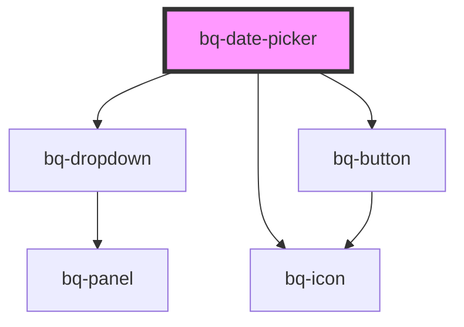

# bq-date-picker

<!-- Auto Generated Below -->

## Overview

The Date Picker is a pure-Stencil calendar input.

It supports single, multi, and range selection, three navigation views
(days → months → years), full localization via `Intl.DateTimeFormat`,
multi-month side-by-side rendering, and RTL layouts.

## Properties

| Property                | Attribute                 | Description                                                                                                                                                                                                                                                                                                                                                                                                                                                     | Type                                                                                                                                                                 | Default           |
| ----------------------- | ------------------------- | --------------------------------------------------------------------------------------------------------------------------------------------------------------------------------------------------------------------------------------------------------------------------------------------------------------------------------------------------------------------------------------------------------------------------------------------------------------- | -------------------------------------------------------------------------------------------------------------------------------------------------------------------- | ----------------- |
| `autofocus`             | `autofocus`               | If `true`, the Date picker input will be focused on component render.                                                                                                                                                                                                                                                                                                                                                                                           | `boolean`                                                                                                                                                            | `false`           |
| `calendarButtonLabel`   | `calendar-button-label`   | The aria-label for the calendar trigger button.                                                                                                                                                                                                                                                                                                                                                                                                                 | `string`                                                                                                                                                             | `'Open calendar'` |
| `clearButtonLabel`      | `clear-button-label`      | The clear button aria label.                                                                                                                                                                                                                                                                                                                                                                                                                                    | `string`                                                                                                                                                             | `'Clear value'`   |
| `disableClear`          | `disable-clear`           | If `true`, the clear button won't be displayed.                                                                                                                                                                                                                                                                                                                                                                                                                 | `boolean`                                                                                                                                                            | `false`           |
| `disabled`              | `disabled`                | Indicates whether the Date picker input is disabled or not.                                                                                                                                                                                                                                                                                                                                                                                                     | `boolean`                                                                                                                                                            | `false`           |
| `distance`              | `distance`                | Distance (gutter) between the Date picker panel and the input element.                                                                                                                                                                                                                                                                                                                                                                                          | `number`                                                                                                                                                             | `8`               |
| `firstDayOfWeek`        | `first-day-of-week`       | The first day of the week, where Sunday is 0, Monday is 1, etc.                                                                                                                                                                                                                                                                                                                                                                                                 | `0 \| 1 \| 2 \| 3 \| 4 \| 5 \| 6`                                                                                                                                    | `1`               |
| `form`                  | `form`                    | The ID of the form the input belongs to.                                                                                                                                                                                                                                                                                                                                                                                                                        | `string`                                                                                                                                                             | `undefined`       |
| `formValidationMessage` | `form-validation-message` | Native form validation message (mandatory if `required` is set).                                                                                                                                                                                                                                                                                                                                                                                                | `string`                                                                                                                                                             | `undefined`       |
| `formatOptions`         | --                        | Options used when formatting the displayed value.  When omitted, sensible defaults are picked based on `precision`: - `day`   → `{ day: 'numeric', month: 'short', year: 'numeric' }` - `month` → `{ month: 'long', year: 'numeric' }` - `year`  → `{ year: 'numeric' }`                                                                                                                                                                                        | `DateTimeFormatOptions`                                                                                                                                              | `undefined`       |
| `initialView`           | `initial-view`            | The view opened first when the panel becomes visible.                                                                                                                                                                                                                                                                                                                                                                                                           | `"days" \| "months" \| "years"`                                                                                                                                      | `'days'`          |
| `isDateDisallowed`      | --                        | Predicate that marks specific dates as unselectable.                                                                                                                                                                                                                                                                                                                                                                                                            | `(date: Date) => boolean`                                                                                                                                            | `undefined`       |
| `locale`                | `locale`                  | Locale used for formatting dates.                                                                                                                                                                                                                                                                                                                                                                                                                               | `Locale \| readonly (string \| Locale)[] \| string`                                                                                                                  | `'en-GB'`         |
| `max`                   | `max`                     | Latest date that can be selected (ISO).                                                                                                                                                                                                                                                                                                                                                                                                                         | `string`                                                                                                                                                             | `undefined`       |
| `min`                   | `min`                     | Earliest date that can be selected (ISO).                                                                                                                                                                                                                                                                                                                                                                                                                       | `string`                                                                                                                                                             | `undefined`       |
| `months`                | `months`                  | Number of months to show side by side (range / multi). Capped at 2. Larger values are silently clamped to keep the popover from overflowing the viewport and to preserve keyboard navigation semantics.                                                                                                                                                                                                                                                         | `number`                                                                                                                                                             | `1`               |
| `monthsPerView`         | `months-per-view`         | How the next/previous buttons should navigate the calendar. - single: navigate one month at a time. - months: navigate by the number of months displayed.                                                                                                                                                                                                                                                                                                       | `"months" \| "single"`                                                                                                                                               | `'single'`        |
| `name` _(required)_     | `name`                    | The Date picker input name.                                                                                                                                                                                                                                                                                                                                                                                                                                     | `string`                                                                                                                                                             | `undefined`       |
| `open`                  | `open`                    | If `true`, the panel is visible.                                                                                                                                                                                                                                                                                                                                                                                                                                | `boolean`                                                                                                                                                            | `false`           |
| `panelHeight`           | `panel-height`            | Overrides the height of the Date picker panel.                                                                                                                                                                                                                                                                                                                                                                                                                  | `string`                                                                                                                                                             | `'auto'`          |
| `placeholder`           | `placeholder`             | Placeholder text shown when no value is selected.                                                                                                                                                                                                                                                                                                                                                                                                               | `string`                                                                                                                                                             | `undefined`       |
| `placement`             | `placement`               | Position of the Date picker panel.                                                                                                                                                                                                                                                                                                                                                                                                                              | `"bottom" \| "bottom-end" \| "bottom-start" \| "left" \| "left-end" \| "left-start" \| "right" \| "right-end" \| "right-start" \| "top" \| "top-end" \| "top-start"` | `'bottom-end'`    |
| `precision`             | `precision`               | Precision of the value produced by the picker.  - `day`   → `YYYY-MM-DD` (default). Standard drill-down. - `month` → `YYYY-MM`. Selection commits on the months view; no days view. - `year`  → `YYYY`. Selection commits on the years view; no months/days view.  When precision is coarser than day, `initialView` is forced to match and the header title cycles through the views available for that precision.                                             | `"day" \| "month" \| "year"`                                                                                                                                         | `'day'`           |
| `required`              | `required`                | Whether a value must be selected before submitting the form.                                                                                                                                                                                                                                                                                                                                                                                                    | `boolean`                                                                                                                                                            | `false`           |
| `showOutsideDays`       | `show-outside-days`       | Whether to render days outside the current month.                                                                                                                                                                                                                                                                                                                                                                                                               | `boolean`                                                                                                                                                            | `false`           |
| `skidding`              | `skidding`                | Skidding between the panel and the input element.                                                                                                                                                                                                                                                                                                                                                                                                               | `number`                                                                                                                                                             | `0`               |
| `strategy`              | `strategy`                | Positioning strategy for the panel.                                                                                                                                                                                                                                                                                                                                                                                                                             | `"absolute" \| "fixed"`                                                                                                                                              | `'fixed'`         |
| `type`                  | `type`                    | Selection type. - `single`: single date. - `multi`: multiple discrete dates. - `range`: contiguous range.                                                                                                                                                                                                                                                                                                                                                       | `"multi" \| "range" \| "single"`                                                                                                                                     | `'single'`        |
| `validationStatus`      | `validation-status`       | Validation state applied to the input.                                                                                                                                                                                                                                                                                                                                                                                                                          | `"error" \| "none" \| "success" \| "warning"`                                                                                                                        | `'none'`          |
| `value`                 | `value`                   | Currently selected value, in the precision-aware wire format: - `precision="day"`   → tokens are `YYYY-MM-DD` - `precision="month"` → tokens are `YYYY-MM` - `precision="year"`  → tokens are `YYYY`  How multiple tokens are combined depends on `type`: - `single` → a single token (e.g. `"2025-05-15"`, `"2025-05"`, `"2025"`) - `range`  → `"start/end"` — two tokens joined with `/` - `multi`  → space-separated tokens (e.g. `"2025-05-15 2025-05-20"`) | `string`                                                                                                                                                             | `undefined`       |

## Events

| Event          | Description                                                                                                                      | Type                                                                                 |
| -------------- | -------------------------------------------------------------------------------------------------------------------------------- | ------------------------------------------------------------------------------------ |
| `bqBlur`       | Callback handler emitted when the input loses focus.                                                                             | `CustomEvent<HTMLBqDatePickerElement>`                                               |
| `bqChange`     | Callback handler emitted when the input value changes.                                                                           | `CustomEvent<{ value: string; el: HTMLBqDatePickerElement; }>`                       |
| `bqClear`      | Callback handler emitted when the value is cleared.                                                                              | `CustomEvent<HTMLBqDatePickerElement>`                                               |
| `bqFocus`      | Callback handler emitted when the input receives focus.                                                                          | `CustomEvent<HTMLBqDatePickerElement>`                                               |
| `bqViewChange` | Callback handler emitted when the internal calendar view changes (e.g. from `days` to `months`, or from `years` back to `days`). | `CustomEvent<{ view: "days" \| "months" \| "years"; el: HTMLBqDatePickerElement; }>` |

## Methods

### `clear() => Promise<void>`

Clears the selected value and any pending validation state (bad input,
bounds overflow). Emits `bqClear`. No-op when the component is disabled.

#### Returns

Type: `Promise<void>`

A promise that resolves once the value has been cleared.

## Slots

| Slot           | Description                                                                     |
| -------------- | ------------------------------------------------------------------------------- |
| `"clear-icon"` | Icon used inside the clear button.                                              |
| `"label"`      | The label displayed above the input.                                            |
| `"prefix"`     | Content rendered before the input value.                                        |
| `"suffix"`     | Icon rendered inside the calendar trigger button (defaults to a calendar icon). |

## Shadow Parts

| Part                         | Description                                                           |
| ---------------------------- | --------------------------------------------------------------------- |
| `"base"`                     | The component's base wrapper.                                         |
| `"button"`                   | Any button rendered inside the calendar (nav or day/month/year cell). |
| `"calendar-trigger"`         | The calendar icon trigger button.                                     |
| `"calendar__container"`      | The calendar panels wrapper.                                          |
| `"calendar__day"`            | Any day button in the day view.                                       |
| `"calendar__disabled"`       | Any button disabled by min/max.                                       |
| `"calendar__disallowed"`     | Any day rejected by `isDateDisallowed`.                               |
| `"calendar__head"`           | The day-view table header row wrapper.                                |
| `"calendar__header"`         | The header row (prev / title / next).                                 |
| `"calendar__heading"`        | The header title button (or month label above a panel).               |
| `"calendar__month"`          | Any month button.                                                     |
| `"calendar__month-selected"` | The currently selected month.                                         |
| `"calendar__months"`         | The month-view grid.                                                  |
| `"calendar__next"`           | The next navigation button.                                           |
| `"calendar__outside"`        | Any day outside the visible month.                                    |
| `"calendar__previous"`       | The previous navigation button.                                       |
| `"calendar__range-end"`      | The last day of a range selection.                                    |
| `"calendar__range-inner"`    | Days between the start and end of a range.                            |
| `"calendar__range-start"`    | The first day of a range selection.                                   |
| `"calendar__selected"`       | Any selected day.                                                     |
| `"calendar__table"`          | The day-view `<table>` element.                                       |
| `"calendar__td"`             | Body cells in the day-view table.                                     |
| `"calendar__th"`             | The day-view weekday header cells.                                    |
| `"calendar__today"`          | The button representing today's date.                                 |
| `"calendar__tr"`             | Any row within the day-view table.                                    |
| `"calendar__week"`           | Body rows in the day-view table.                                      |
| `"calendar__year"`           | Any year button.                                                      |
| `"calendar__year-selected"`  | The currently selected year.                                          |
| `"calendar__years"`          | The year-view grid.                                                   |
| `"clear-btn"`                | The clear button.                                                     |
| `"control"`                  | The input control wrapper.                                            |
| `"input"`                    | The native input element.                                             |
| `"label"`                    | The label slot container.                                             |
| `"panel"`                    | The dropdown panel container.                                         |
| `"prefix"`                   | The prefix slot container.                                            |
| `"suffix"`                   | The suffix slot container.                                            |

## Dependencies

### Depends on

- [bq-dropdown](../dropdown)
- [bq-button](../button)
- [bq-icon](../icon)

### Graph

```mermaid
graph TD;
  bq-date-picker --> bq-dropdown
  bq-date-picker --> bq-button
  bq-date-picker --> bq-icon
  bq-dropdown --> bq-panel
  bq-button --> bq-icon
  style bq-date-picker fill:#f9f,stroke:#333,stroke-width:4px
```

----------------------------------------------

*Built with [StencilJS](https://stenciljs.com/)*
