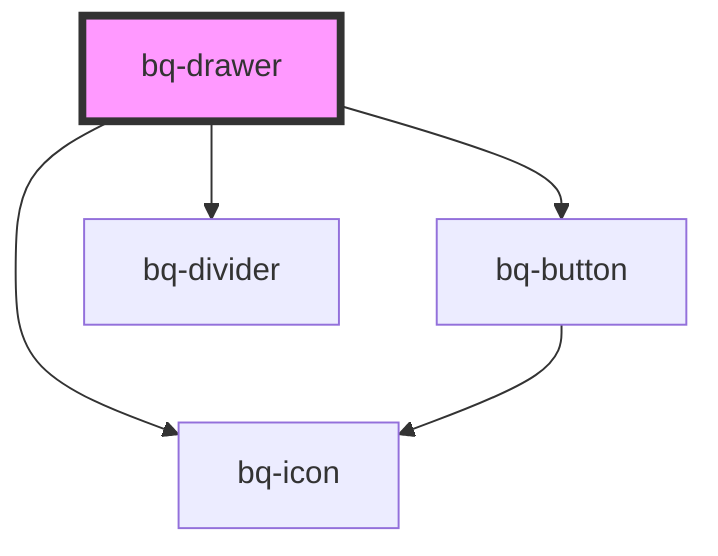

# bq-drawer

<!-- Auto Generated Below -->

## Properties

| Property                   | Attribute                     | Description                                                              | Type                | Default     |
| -------------------------- | ----------------------------- | ------------------------------------------------------------------------ | ------------------- | ----------- |
| `disableCloseClickOutside` | `disable-close-click-outside` | If true, the drawer will not close when clicking on the backdrop overlay | `boolean`           | `true`      |
| `disableCloseEscKeydown`   | `disable-close-esc-keydown`   | If true, the dialog will not close when the [Esc] key is press           | `boolean`           | `true`      |
| `enableBackdrop`           | `enable-backdrop`             | If true, the backdrop overlay will be shown when the drawer opens        | `boolean`           | `false`     |
| `open`                     | `open`                        | If true, the drawer component will be shown                              | `boolean`           | `undefined` |
| `placement`                | `placement`                   | Defines the position of the drawer                                       | `"left" \| "right"` | `'left'`    |

## Events

| Event          | Description                                                    | Type               |
| -------------- | -------------------------------------------------------------- | ------------------ |
| `bqAfterClose` | Callback handler to be called after the drawer has been closed | `CustomEvent<any>` |
| `bqAfterOpen`  | Callback handler to be called after the drawer has been opened | `CustomEvent<any>` |
| `bqClose`      | Callback handler to be called when the drawer is closed        | `CustomEvent<any>` |
| `bqOpen`       | Callback handler to be called when the drawer is opened        | `CustomEvent<any>` |

## Methods

### `hide() => Promise<void>`

Method to be called to hide the drawer component

#### Returns

Type: `Promise<void>`

### `show() => Promise<void>`

Method to be called to show the drawer component

#### Returns

Type: `Promise<void>`

## Shadow Parts

| Part             | Description                                                        |
| ---------------- | ------------------------------------------------------------------ |
| `"body"`         | The `<main>` that holds the drawer body content                    |
| `"button-close"` | The button that close the dialog on click                          |
| `"content"`      | The `
` container that holds the drawer title and body content |
| `"footer"`       | The `<footer>` that holds footer content                           |
| `"header"`       | The `<header>` that holds the icon, title, and close button        |
| `"title"`        | The `
` that holds the title content                           |
| `"wrapper"`      | The `
` wrapper container inside the shadow DOM                |

## Dependencies

### Depends on

- [bq-button](../button)
- [bq-icon](../icon)
- [bq-divider](../divider)

### Graph

----------------------------------------------

*Built with [StencilJS](https://stenciljs.com/)*
