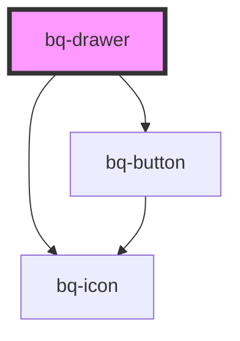

# bq-drawer

<!-- Auto Generated Below -->

## Properties

| Property | Attribute | Description                                 | Type      | Default     |
| -------- | --------- | ------------------------------------------- | --------- | ----------- |
| `open`   | `open`    | If true, the drawer component will be shown | `boolean` | `undefined` |

## Events

| Event          | Description                                                          | Type               |
| -------------- | -------------------------------------------------------------------- | ------------------ |
| `bqAfterClose` | Callback handler to be called after the notification has been closed | `CustomEvent<any>` |
| `bqAfterOpen`  | Callback handler to be called after the notification has been opened | `CustomEvent<any>` |
| `bqHide`       | Callback handler to be called when the notification is hidden        | `CustomEvent<any>` |
| `bqShow`       | Callback handler to be called when the notification is shown         | `CustomEvent<any>` |

## Methods

### `hide() => Promise<void>`

Method to be called to hide the notification component

#### Returns

Type: `Promise<void>`

### `show() => Promise<void>`

Method to be called to show the notification component

#### Returns

Type: `Promise<void>`

## Shadow Parts

| Part          | Description |
| ------------- | ----------- |
| `"btn-close"` |             |
| `"header"`    |             |
| `"wrapper"`   |             |

## Dependencies

### Depends on

- [bq-button](../button)
- [bq-icon](../icon)

### Graph

----------------------------------------------

*Built with [StencilJS](https://stenciljs.com/)*
