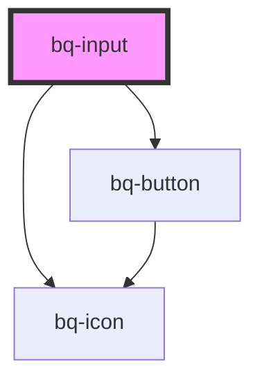

# bq-input

<!-- Auto Generated Below -->

## Overview

The Input component is a fundamental user interface element that allows users to input data by typing it into a text field.
It is commonly used in web and mobile applications for various purposes, such as collecting user information, search inputs, and login forms.

## Properties

| Property            | Attribute            | Description                                                                                                                                                                                                                                                                                                                  | Type                                                                                                                | Default         |
| ------------------- | -------------------- | ---------------------------------------------------------------------------------------------------------------------------------------------------------------------------------------------------------------------------------------------------------------------------------------------------------------------------- | ------------------------------------------------------------------------------------------------------------------- | --------------- |
| `autocapitalize`    | `autocapitalize`     | Controls whether or not the input field should be capitalized and how. Possible values are 'off', 'none', 'on', 'sentences', 'words', and 'characters'. See: https://developer.mozilla.org/en-US/docs/Web/HTML/Global_attributes/autocapitalize                                                                              | `string`                                                                                                            | `'off'`         |
| `autocomplete`      | `autocomplete`       | Specifies whether or not the input field should have autocomplete enabled. See: https://developer.mozilla.org/en-US/docs/Web/HTML/Attributes/autocomplete#values                                                                                                                                                             | `string`                                                                                                            | `'off'`         |
| `autocorrect`       | `autocorrect`        | Controls whether or not the input field should have autocorrect enabled. Possible values are 'on' and 'off'.                                                                                                                                                                                                                 | `"off" \| "on"`                                                                                                     | `'off'`         |
| `autofocus`         | `autofocus`          | If true, the input will be focused on component render                                                                                                                                                                                                                                                                       | `boolean`                                                                                                           | `undefined`     |
| `clearButtonLabel`  | `clear-button-label` | The clear button aria label                                                                                                                                                                                                                                                                                                  | `string`                                                                                                            | `'Clear value'` |
| `debounceTime`      | `debounce-time`      | The amount of time, in milliseconds, to wait before emitting the `bqInput` event after the input value changes. A value of 0 means no debouncing will occur.                                                                                                                                                                 | `number`                                                                                                            | `0`             |
| `disableClear`      | `disable-clear`      | If true, the clear button won't be displayed                                                                                                                                                                                                                                                                                 | `boolean`                                                                                                           | `false`         |
| `disabled`          | `disabled`           | Indicates whether the input is disabled or not. If `true`, the input is disabled and cannot be interacted with.                                                                                                                                                                                                              | `boolean`                                                                                                           | `false`         |
| `form`              | `form`               | The ID of the form that the input field belongs to.                                                                                                                                                                                                                                                                          | `string`                                                                                                            | `undefined`     |
| `inputmode`         | `inputmode`          | The inputmode attribute specifies what kind of input mechanism would be most helpful for users entering content into the input field. This allows a browser to display an appropriate virtual keyboard while editing. Possible values are 'none', 'text', 'decimal', 'numeric', 'tel', 'search', 'email', 'url', and 'date'. | `string`                                                                                                            | `undefined`     |
| `max`               | `max`                | The maximum value that the input field can accept. Only applies to date and number input types.                                                                                                                                                                                                                              | `number \| string`                                                                                                  | `undefined`     |
| `maxlength`         | `maxlength`          | The maximum number of characters that the input field can accept.                                                                                                                                                                                                                                                            | `number`                                                                                                            | `undefined`     |
| `min`               | `min`                | The minimum value that the input field can accept. Only applies to date and number input types.                                                                                                                                                                                                                              | `number \| string`                                                                                                  | `undefined`     |
| `minlength`         | `minlength`          | The minimum number of characters that the input field can accept.                                                                                                                                                                                                                                                            | `number`                                                                                                            | `undefined`     |
| `name` _(required)_ | `name`               | The input field name.                                                                                                                                                                                                                                                                                                        | `string`                                                                                                            | `undefined`     |
| `pattern`           | `pattern`            | Specifies a regular expression the form control's value should match. See: https://developer.mozilla.org/en-US/docs/Web/HTML/Attributes/pattern                                                                                                                                                                              | `string`                                                                                                            | `undefined`     |
| `placeholder`       | `placeholder`        | The input placeholder text value                                                                                                                                                                                                                                                                                             | `string`                                                                                                            | `undefined`     |
| `readonly`          | `readonly`           | If true, the input field cannot be modified.                                                                                                                                                                                                                                                                                 | `boolean`                                                                                                           | `undefined`     |
| `required`          | `required`           | Indicates whether or not the input field is required to be filled out before submitting the form.                                                                                                                                                                                                                            | `boolean`                                                                                                           | `undefined`     |
| `step`              | `step`               | A number that specifies the granularity that the value must adhere to. Valid for date, month, week, time, datetime-local, number, and range. See: https://developer.mozilla.org/en-US/docs/Web/HTML/Element/input#step                                                                                                       | `"any" \| number`                                                                                                   | `undefined`     |
| `type`              | `type`               | The type attribute specifies the type of input field to display. Possible values are 'text', 'password', 'email', 'number', 'tel', 'search', 'url', and more. See: https://developer.mozilla.org/en-US/docs/Web/HTML/Element/input#input_types                                                                               | `"date" \| "datetime-local" \| "email" \| "number" \| "password" \| "search" \| "tel" \| "text" \| "time" \| "url"` | `'text'`        |
| `validationStatus`  | `validation-status`  | The validation status of the input.                                                                                                                                                                                                                                                                                          | `"error" \| "none" \| "success" \| "warning"`                                                                       | `'none'`        |
| `value`             | `value`              | The input value, it can be used to reset the input to a previous value                                                                                                                                                                                                                                                       | `number \| string \| string[]`                                                                                      | `undefined`     |

## Events

| Event      | Description                                                                                                                                                                                                                    | Type                                                                            |
| ---------- | ------------------------------------------------------------------------------------------------------------------------------------------------------------------------------------------------------------------------------ | ------------------------------------------------------------------------------- |
| `bqBlur`   | Callback handler emitted when the input loses focus                                                                                                                                                                            | `CustomEvent<HTMLBqInputElement>`                                               |
| `bqChange` | Callback handler emitted when the input value has changed and the input loses focus. This handler is called whenever the user finishes typing or pasting text into the input field and then clicks outside of the input field. | `CustomEvent<{ value: string \| number \| string[]; el: HTMLBqInputElement; }>` |
| `bqClear`  | Callback handler emitted when the input value has been cleared                                                                                                                                                                 | `CustomEvent<HTMLBqInputElement>`                                               |
| `bqFocus`  | Callback handler emitted when the input has received focus                                                                                                                                                                     | `CustomEvent<HTMLBqInputElement>`                                               |
| `bqInput`  | Callback handler emitted when the input value changes. This handler is called whenever the user types or pastes text into the input field.                                                                                     | `CustomEvent<{ value: string \| number \| string[]; el: HTMLBqInputElement; }>` |

## Slots

| Slot            | Description                     |
| --------------- | ------------------------------- |
| `"clear-icon"`  | The clear icon slot container.  |
| `"helper-text"` | The helper text slot container. |
| `"label"`       | The label slot container.       |
| `"prefix"`      | The prefix slot container.      |
| `"suffix"`      | The suffix slot container.      |

## Shadow Parts

| Part            | Description                                                     |
| --------------- | --------------------------------------------------------------- |
| `"base"`        | The component's base wrapper.                                   |
| `"button"`      | The native HTML button used under the hood in the clear button. |
| `"clear-btn"`   | The clear button.                                               |
| `"control"`     | The input control wrapper.                                      |
| `"helper-text"` | The helper text slot container.                                 |
| `"input"`       | The native HTML input element used under the hood.              |
| `"label"`       | The label slot container.                                       |
| `"prefix"`      | The prefix slot container.                                      |
| `"suffix"`      | The suffix slot container.                                      |

## Dependencies

### Depends on

- [bq-button](../button)
- [bq-icon](../icon)

### Graph

----------------------------------------------

*Built with [StencilJS](https://stenciljs.com/)*
