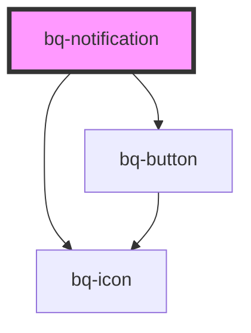

# bq-notification

<!-- Auto Generated Below -->

## Properties

| Property       | Attribute       | Description                                                                                                             | Type                                                       | Default     |
| -------------- | --------------- | ----------------------------------------------------------------------------------------------------------------------- | ---------------------------------------------------------- | ----------- |
| `autoDismiss`  | `auto-dismiss`  | If true, the notification will automatically hide after the specified amount of time                                    | `boolean`                                                  | `undefined` |
| `border`       | `border`        | The corder radius of the notification component                                                                         | `"full" \| "l" \| "m" \| "none" \| "s" \| "xs" \| "xs2"`   | `'s'`       |
| `disableClose` | `disable-close` | If true, the close button at the top right of the notification won't be shown                                           | `boolean`                                                  | `undefined` |
| `hideIcon`     | `hide-icon`     | If true, the notification icon won't be shown                                                                           | `boolean`                                                  | `undefined` |
| `open`         | `open`          | If true, the notification will be shown                                                                                 | `boolean`                                                  | `undefined` |
| `time`         | `time`          | The length of time, in milliseconds, after which the notification will close itself. Only valid if `autoDismiss="true"` | `number`                                                   | `3000`      |
| `type`         | `type`          | Type of Notification                                                                                                    | `"error" \| "info" \| "neutral" \| "success" \| "warning"` | `'info'`    |

## Events

| Event          | Description                                                          | Type               |
| -------------- | -------------------------------------------------------------------- | ------------------ |
| `bqAfterClose` | Callback handler to be called after the notification has been closed | `CustomEvent<any>` |
| `bqAfterOpen`  | Callback handler to be called after the notification has been opened | `CustomEvent<any>` |
| `bqHide`       | Callback handler to be called when the notification is hidden        | `CustomEvent<any>` |
| `bqShow`       | Callback handler to be called when the notification is shown         | `CustomEvent<any>` |

## Methods

### `hide() => Promise<void>`

Method to be called to hide the notification component

#### Returns

Type: `Promise<void>`

### `show() => Promise<void>`

Method to be called to show the notification component

#### Returns

Type: `Promise<void>`

### `toast() => Promise<void>`

This method can be used to display notifications in a fixed-position element that allows for stacking multiple notifications vertically

#### Returns

Type: `Promise<void>`

## Slots

| Slot          | Description                                  |
| ------------- | -------------------------------------------- |
|               | The notification title content               |
| `"body"`      | The notification description content         |
| `"btn-close"` | The close button of the notification         |
| `"footer"`    | The notification footer content              |
| `"icon"`      | The icon to be displayed in the notification |

## Shadow Parts

| Part             | Description                                                                                |
| ---------------- | ------------------------------------------------------------------------------------------ |
| `"base"`         | The `
` container of the predefined bq-icon component.                                 |
| `"body"`         | The container `
` that wraps the notification description content                      |
| `"btn-close"`    | The `bq-button` used to close the notification                                             |
| `"content"`      | The container `
` that wraps all the notification content (title, description, footer) |
| `"footer"`       | The container `
` that wraps the notification footer content                           |
| `"icon"`         | The `<bq-icon>` element used to render a predefined icon based on the notification type    |
| `"icon-outline"` | The container `
` that wraps the icon element                                          |
| `"main"`         | The container `
` that wraps the notification main content (title, description)        |
| `"svg"`          | The `<svg>` element of the predefined bq-icon component.                                   |
| `"title"`        | The container `
` that wraps the notification title content                            |
| `"wrapper"`      | The wrapper container `
` of the element inside the shadow DOM                         |

## Dependencies

### Depends on

- [bq-button](../button)
- [bq-icon](../icon)

### Graph

----------------------------------------------

*Built with [StencilJS](https://stenciljs.com/)*
