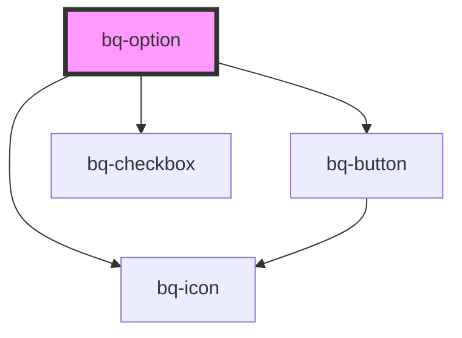

# bq-option

<!-- Auto Generated Below -->

## Overview

An option refers to a specific choice that appears in a list of selectable items that can be opened or closed by the user.
It can be an element of the navigation system that allows users to select different sections or pages within an application or it can be used within a dropdown list.

## Properties

| Property               | Attribute                | Description                                                                                                              | Type      | Default              |
| ---------------------- | ------------------------ | ------------------------------------------------------------------------------------------------------------------------ | --------- | -------------------- |
| `allSelectedLabel`     | `all-selected-label`     | Text displayed when all selectable nested options are selected.                                                          | `string`  | `'All selected'`     |
| `checkbox`             | `checkbox`               | If true, the option renders as a checkbox option.                                                                        | `boolean` | `false`              |
| `disabled`             | `disabled`               | If true, the option is disabled.                                                                                         | `boolean` | `false`              |
| `displayValue`         | `display-value`          | The display value of the option. It can be used to override the default displayed value.                                 | `string`  | `undefined`          |
| `expanded`             | `expanded`               | If true, nested options are displayed.                                                                                   | `boolean` | `false`              |
| `hidden`               | `hidden`                 | If true, the option is hidden.                                                                                           | `boolean` | `false`              |
| `indeterminate`        | `indeterminate`          | If true, the option checkbox represents a partial nested selection.                                                      | `boolean` | `false`              |
| `selected`             | `selected`               | If true, the option is selected and active.                                                                              | `boolean` | `false`              |
| `selectedCountLabel`   | `selected-count-label`   | Text displayed when some selectable nested options are selected. Use `{count}` as the selected option count placeholder. | `string`  | `'{count} selected'` |
| `showSelectionSummary` | `show-selection-summary` | If true, displays the nested selection summary beside the expand control.                                                | `boolean` | `true`               |
| `value`                | `value`                  | A string representing the value of the option. Can be used to identify the item                                          | `string`  | `undefined`          |

## Events

| Event     | Description                                | Type                               |
| --------- | ------------------------------------------ | ---------------------------------- |
| `bqBlur`  | Handler to be called when item loses focus | `CustomEvent<HTMLBqOptionElement>` |
| `bqClick` | Handler to be called when item is clicked  | `CustomEvent<HTMLBqOptionElement>` |
| `bqEnter` | Handler to be called on enter key press    | `CustomEvent<HTMLBqOptionElement>` |
| `bqFocus` | Handler to be called when item is focused  | `CustomEvent<HTMLBqOptionElement>` |

## Slots

| Slot             | Description                                                |
| ---------------- | ---------------------------------------------------------- |
|                  | The label content to be displayed.                         |
| `"expand-label"` | Optional text displayed in the expand or collapse control. |
| `"options"`      | Nested option items displayed when the option is expanded. |
| `"prefix"`       | The prefix content to be displayed before the label.       |
| `"suffix"`       | The suffix content to be displayed after the label.        |

## Shadow Parts

| Part                  | Description                                                                |
| --------------------- | -------------------------------------------------------------------------- |
| `"base"`              | The option selection control.                                              |
| `"checkbox-base"`     | The checkbox base wrapper exported from the nested `bq-checkbox`.          |
| `"checkbox-checkbox"` | The checkbox indicator exported from the nested `bq-checkbox`.             |
| `"checkbox-control"`  | The checkbox control wrapper exported from the nested `bq-checkbox`.       |
| `"checkbox-input"`    | The native checkbox input exported from the nested `bq-checkbox`.          |
| `"checkbox-label"`    | The checkbox label exported from the nested `bq-checkbox`.                 |
| `"expand"`            | The button used to expand or collapse nested options.                      |
| `"expand-button"`     | The native button exported from the expand control.                        |
| `"expand-label"`      | The label exported from the expand control.                                |
| `"item"`              | The interactive option row.                                                |
| `"label"`             | The `span` element in which the label text is displayed.                   |
| `"options"`           | The container for nested options.                                          |
| `"prefix"`            | The `span` element in which the prefix is displayed (generally `bq-icon`). |
| `"selection-summary"` | The nested selection summary displayed beside the expand control.          |
| `"suffix"`            | The `span` element in which the suffix is displayed (generally `bq-icon`). |

## Dependencies

### Depends on

- [bq-button](../button)
- [bq-icon](../icon)
- [bq-checkbox](../checkbox)

### Graph

----------------------------------------------

*Built with [StencilJS](https://stenciljs.com/)*
