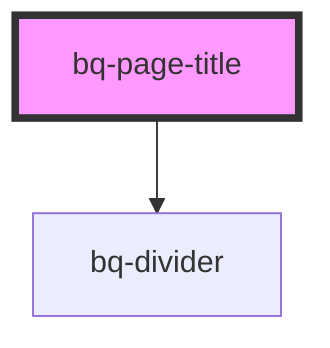

# bq-page-title

<!-- Auto Generated Below -->

## Shadow Parts

| Part             | Description                                                                                             |
| ---------------- | ------------------------------------------------------------------------------------------------------- |
| `"back"`         | The container `
` page title element that acts as back slot container.                              |
| `"base"`         | The inner container `
`of element that contains the base page title component.                      |
| `"content"`      | Defines the main container of the page title component, which includes the title and subtitle elements. |
| `"divider"`      | The inner container `
` of element that acts as divider slot container.                             |
| `"sub-title"`    | The `
` page title element that acts as sub-title slot container.                                   |
| `"suffix"`       | The `
` page title element that acts as suffix slot container.                                      |
| `"title"`        | The `<h1>` element serves as a container for the page title content, to improve accessibility.          |
| `"title-suffix"` | Defines the container that holds the title and any suffix content.                                      |
| `"wrapper"`      | The wrapper container `
` of the element inside the shadow DOM.                                     |

## Dependencies

### Depends on

- [bq-divider](../divider)

### Graph

----------------------------------------------

*Built with [StencilJS](https://stenciljs.com/)*
