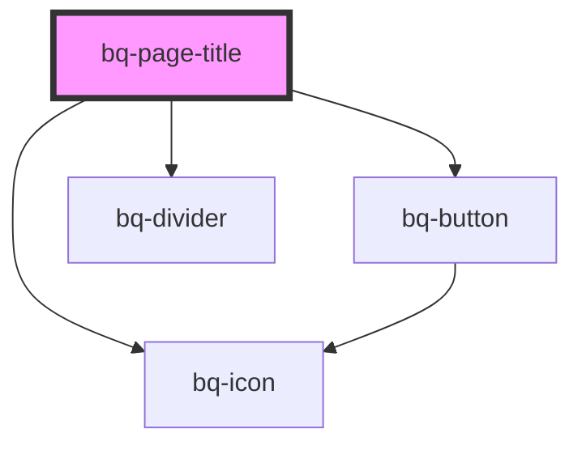

# bq-page-title

<!-- Auto Generated Below -->

## Properties

| Property             | Attribute              | Description                                       | Type      | Default     |
| -------------------- | ---------------------- | ------------------------------------------------- | --------- | ----------- |
| `haveBackNavigation` | `have-back-navigation` | If true, the page title back button will be shown | `boolean` | `undefined` |

## Events

| Event         | Description                                                        | Type                                  |
| ------------- | ------------------------------------------------------------------ | ------------------------------------- |
| `bqBackBlur`  | Handler to be called when page title navigation button loses focus | `CustomEvent<HTMLBqPageTitleElement>` |
| `bqBackClick` | Handler to be called when page title navigation button is clicked  | `CustomEvent<HTMLBqPageTitleElement>` |
| `bqBackFocus` | Handler to be called when page title navigation button is focused  | `CustomEvent<HTMLBqPageTitleElement>` |

## Shadow Parts

| Part             | Description                                                                                             |
| ---------------- | ------------------------------------------------------------------------------------------------------- |
| `"back"`         | The container `
` that wraps the page title back icon button.                                       |
| `"base"`         | The inner container `
`of element that contains the base page title component.                      |
| `"btn-back"`     | The back navigation button.                                                                             |
| `"content"`      | Defines the main container of the page title component, which includes the title and subtitle elements. |
| `"divider"`      | The inner container `
` of element that acts as divider slot container.                             |
| `"icon"`         | The `<bq-icon>` element used to render a predefined back navigation icon for page title.                |
| `"sub-title"`    | The `
` page title element that acts as sub-title slot container.                                   |
| `"suffix"`       | The `
` page title element that acts as suffix slot container.                                      |
| `"title"`        | The container `
` that wraps the page title content.                                                |
| `"title-suffix"` | Defines the container that holds the title and any suffix content.                                      |
| `"wrapper"`      | The wrapper container `
` of the element inside the shadow DOM.                                     |

## Dependencies

### Depends on

- [bq-button](../button)
- [bq-icon](../icon)
- [bq-divider](../divider)

### Graph

----------------------------------------------

*Built with [StencilJS](https://stenciljs.com/)*
