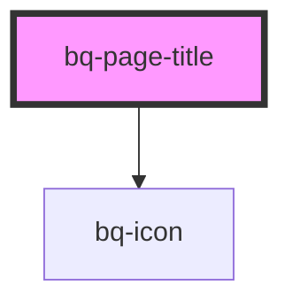

# bq-page-title

<!-- Auto Generated Below -->

## Properties

| Property       | Attribute        | Description                                     | Type      | Default     |
| -------------- | ---------------- | ----------------------------------------------- | --------- | ----------- |
| `showBackIcon` | `show-back-icon` | If true, the page title back icon will be shown | `boolean` | `undefined` |

## Shadow Parts

| Part        | Description |
| ----------- | ----------- |
| `"back"`    |             |
| `"icon"`    |             |
| `"title"`   |             |
| `"wrapper"` |             |

## Dependencies

### Depends on

- [bq-icon](../icon)

### Graph

----------------------------------------------

*Built with [StencilJS](https://stenciljs.com/)*
