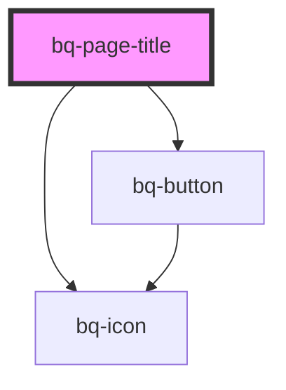

# bq-page-title

<!-- Auto Generated Below -->

## Properties

| Property             | Attribute              | Description                                       | Type      | Default     |
| -------------------- | ---------------------- | ------------------------------------------------- | --------- | ----------- |
| `haveBackNavigation` | `have-back-navigation` | If true, the page title back button will be shown | `boolean` | `undefined` |

## Events

| Event     | Description                                                        | Type                                  |
| --------- | ------------------------------------------------------------------ | ------------------------------------- |
| `bqBlur`  | Handler to be called when page title navigation button loses focus | `CustomEvent<HTMLBqPageTitleElement>` |
| `bqClick` | Handler to be called when page title navigation button is clicked  | `CustomEvent<HTMLBqPageTitleElement>` |
| `bqFocus` | Handler to be called when page title navigation button is focused  | `CustomEvent<HTMLBqPageTitleElement>` |

## Shadow Parts

| Part          | Description                                                                              |
| ------------- | ---------------------------------------------------------------------------------------- |
| `"back"`      | The container `
` that wraps the page title back icon button.                        |
| `"btn-back"`  | The back navigation button.                                                              |
| `"icon"`      | The `<bq-icon>` element used to render a predefined back navigation icon for page title. |
| `"prefix"`    | The `
` page title element that acts as prefix slot container.                       |
| `"sub-title"` | The `
` page title element that acts as sub-title slot container.                    |
| `"suffix"`    | The `
` page title element that acts as suffix slot container.                       |
| `"title"`     | The container `
` that wraps the page title content.                                 |
| `"wrapper"`   | The wrapper container `
` of the element inside the shadow DOM.                      |

## Dependencies

### Depends on

- [bq-button](../button)
- [bq-icon](../icon)

### Graph

----------------------------------------------

*Built with [StencilJS](https://stenciljs.com/)*
