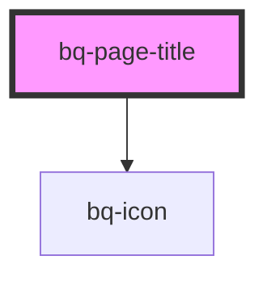

# bq-page-title

<!-- Auto Generated Below -->

## Properties

| Property          | Attribute           | Description                                        | Type      | Default     |
| ----------------- | ------------------- | -------------------------------------------------- | --------- | ----------- |
| `showActionIcons` | `show-action-icons` | If true, the page title back icon will be shown    | `boolean` | `undefined` |
| `showBackIcon`    | `show-back-icon`    | If true, the page title back icon will be shown    | `boolean` | `undefined` |
| `showSubTitle`    | `show-sub-title`    | If true, the sub title of page title will be shown | `boolean` | `undefined` |

## Shadow Parts

| Part          | Description                                                                                                       |
| ------------- | ----------------------------------------------------------------------------------------------------------------- |
| `"actions"`   | The container `
` element used to render a edit and download icons for page title                             |
| `"back"`      | The container `
` that wraps the page title back icon                                                         |
| `"icon"`      | The `<bq-icon>` element used to render a predefined icon size based on the page title (back, edit, download icon) |
| `"sub-title"` | The container `
` that wraps the sub-title element                                                            |
| `"title"`     | The container `
` that wraps the pate title content                                                           |
| `"wrapper"`   | The wrapper container `
` of the element inside the shadow DOM                                                |

## Dependencies

### Depends on

- [bq-icon](../icon)

### Graph

----------------------------------------------

*Built with [StencilJS](https://stenciljs.com/)*
