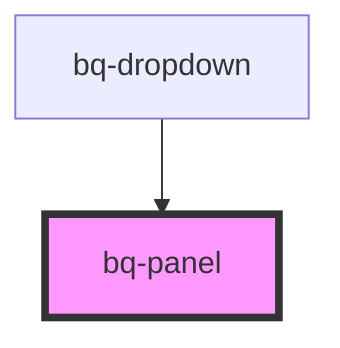

# bq-panel

<!-- Auto Generated Below -->

## Properties

| Property    | Attribute    | Description                                                                           | Type                                                                                                                                                                              | Default          |
| ----------- | ------------ | ------------------------------------------------------------------------------------- | --------------------------------------------------------------------------------------------------------------------------------------------------------------------------------- | ---------------- |
| `distance`  | `distance`   | Represents the distance (gutter or margin) between the panel and the trigger element. | `number \| undefined`                                                                                                                                                             | `4`              |
| `open`      | `open`       | If true, the panel will be visible.                                                   | `boolean \| undefined`                                                                                                                                                            | `false`          |
| `placement` | `placement`  | Position of the panel                                                                 | `"bottom" \| "bottom-end" \| "bottom-start" \| "left" \| "left-end" \| "left-start" \| "right" \| "right-end" \| "right-start" \| "top" \| "top-end" \| "top-start" \| undefined` | `'bottom-start'` |
| `sameWidth` | `same-width` | Whether the panel should have the same width as the trigger element                   | `boolean \| undefined`                                                                                                                                                            | `false`          |
| `skidding`  | `skidding`   | Represents the skidding between the panel and the trigger element.                    | `number \| undefined`                                                                                                                                                             | `0`              |
| `strategy`  | `strategy`   | Defines the strategy to position the panel                                            | `"absolute" \| "fixed" \| undefined`                                                                                                                                              | `'fixed'`        |

## Shadow Parts

| Part      | Description                                             |
| --------- | ------------------------------------------------------- |
| `"panel"` | The `
` element used to display and style the panel |

## Dependencies

### Used by

 - [bq-dropdown](../dropdown)

### Graph

----------------------------------------------

*Built with [StencilJS](https://stenciljs.com/)*
