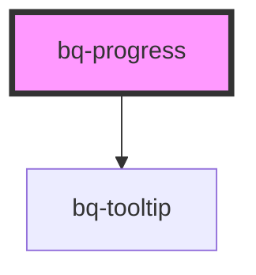

# bq-progress

<!-- Auto Generated Below -->

## Properties

| Property        | Attribute        | Description                                                            | Type                               | Default         |
| --------------- | ---------------- | ---------------------------------------------------------------------- | ---------------------------------- | --------------- |
| `borderShape`   | `border-shape`   | If `rounded`, the progress bar will be displayed without border radius | `"rounded" \| "square"`            | `'rounded'`     |
| `enableTooltip` | `enable-tooltip` | It `true`, the progress bar will be displayed with percentage tooltip  | `boolean`                          | `false`         |
| `label`         | `label`          | It `true`, the progress bar will be displayed with percentage text     | `boolean`                          | `false`         |
| `mode`          | `mode`           | It defines the mode of progress bar to display                         | `"determinate" \| "indeterminate"` | `'determinate'` |
| `thickness`     | `thickness`      | Progress bar thickness                                                 | `"large" \| "medium"`              | `'medium'`      |
| `type`          | `type`           | Progress type                                                          | `"default" \| "error"`             | `'default'`     |
| `value`         | `value`          | A number representing the current value of the progress bar            | `number`                           | `0`             |

## Dependencies

### Depends on

- [bq-tooltip](../tooltip)

### Graph

----------------------------------------------

*Built with [StencilJS](https://stenciljs.com/)*
